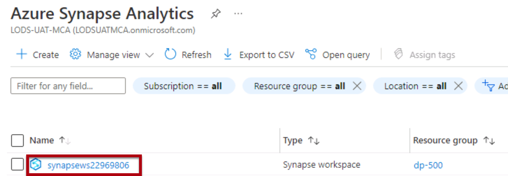
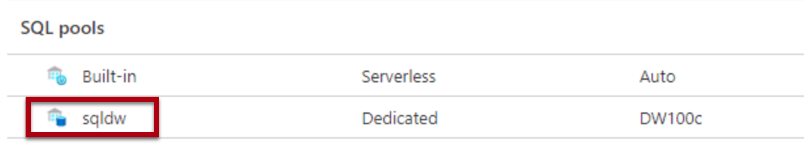
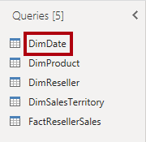
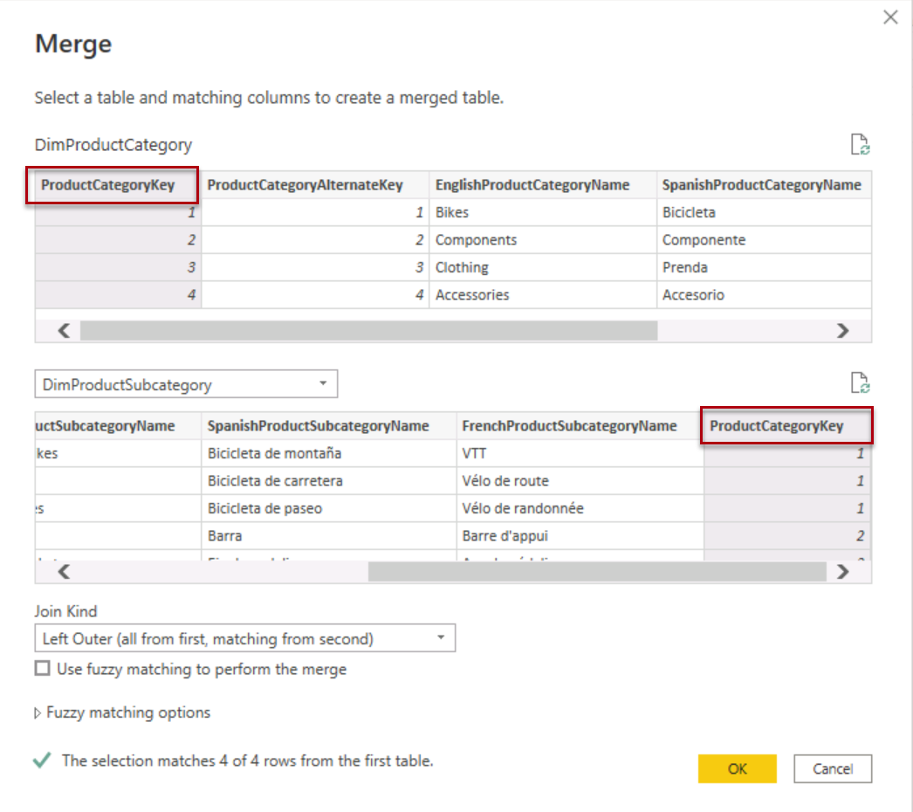

---
lab:
  title: Criar um modelo de esquema em estrela
  module: Prepare data for tabular models in Power BI
---

# Criar um modelo de esquema em estrela

## Visão geral

**O tempo estimado para concluir o laboratório é de 30 minutos**

Neste laboratório, você usará o Power BI Desktop para desenvolver um modelo de dados no data warehouse do Azure Synapse Adventure Works. O modelo de dados permitirá que você publique uma camada semântica sobre o data warehouse.

Neste laboratório, você aprenderá a:

- Criar uma conexão do Power BI ao SQL do Azure Synapse Analytics.

- Desenvolver consultas de modelo.

- Organizar o diagrama de modelo.

## Introdução

Neste exercício, prepare seu ambiente.

### Carregar dados no Azure Synapse Analytics

   > **Observação**: se você já tiver carregado dados no Azure Synapse Analytics usando um clone do git, ignore essa tarefa e prossiga para Configurar o **Power BI.**

1. Entre no portal do [Azure](https://portal.azure.com) usando as informações de logon localizadas na guia Recursos no lado direito da VM.
2. Use o botão **[\>_]** à direita da barra de pesquisa na parte superior da página para criar um Cloud Shell no portal do Azure, selecionando um ambiente ***PowerShell*** criando um armazenamento caso solicitado. O Cloud Shell fornece uma interface de linha de comando em um painel na parte inferior do portal do Azure, conforme mostrado aqui:

    

    > **Observação**: se você tiver criado anteriormente um shell de nuvem que usa um ambiente *Bash*, use o menu suspenso no canto superior esquerdo do painel do shell de nuvem para alterá-lo para ***PowerShell***.

3. Observe que você pode redimensionar o Cloud Shell arrastando a barra do separador na parte superior do painel ou usando os ícones **&#8212;** , **&#9723;** e **X** no canto superior direito do painel para minimizar, maximizar e fechar o painel. Para obter mais informações de como usar o Azure Cloud Shell, confira a [documentação do Azure Cloud Shell](https://docs.microsoft.com/azure/cloud-shell/overview).

4. No painel do PowerShell, insira o seguinte comando para clonar este repositório:

    ```
    rm -r dp500 -f
    git clone https://github.com/MicrosoftLearning/DP-500-Azure-Data-Analyst dp500
    ```

5. Depois que o repositório tiver sido clonado, digite os seguintes comandos para alterar para a pasta de **instalação** e executar o **script setup.ps1** contido nela:

    ```
    cd dp500/Allfiles/04
    ./setup.ps1
    ```

6. Quando solicitado, insira uma senha adequada a ser definida para seu pool de SQL do Azure Synapse.

    > **Observação**: memorize a senha!

7. Aguarde a conclusão do script – isso normalmente leva cerca de 20 minutos; mas em alguns casos pode demorar mais.
8. Depois de criar o workspace Synapse e o Pool de SQL e carregar os dados, o script pausa o pool para evitar cobranças desnecessárias do Azure. Quando estiver pronto para trabalhar com seus dados no Azure Synapse Analytics, você precisará retomar o Pool de SQL.

### Clonar o repositório para este curso

1. No menu Iniciar, abra o Prompt de Comando

    
2. Na janela do prompt de comando, navegue até a unidade D digitando:

    `d:`

   Pressione ENTER.

    

3. Na janela do prompt de comando, digite o seguinte comando para baixar os arquivos do curso e salve-os em uma pasta chamada DP500.

   `git clone https://github.com/MicrosoftLearning/DP-500-Azure-Data-Analyst DP500`

4. Quando o repositório tiver sido clonado, abra a unidade D no explorador de arquivos para garantir que os arquivos tenham sido baixados.

### Configurar Power BI

Nesta tarefa, você configurará o Power BI Desktop.

1. Para abrir o Power BI Desktop, na barra de tarefas, selecione o atalho do **Power BI Desktop**.

2. Feche a janela de introdução selecionando o **X** localizado no canto superior direito.

3. No canto superior direito do Power BI Desktop, se ainda não tiver iniciado sessão, selecione **Iniciar sessão**. Use as credenciais do laboratório para concluir o processo de entrada.

4. Você será redirecionado para a página de inscrição do Power BI no Microsoft Edge. Selecione **Continuar** para concluir a inscrição.

   

5. Insira um número de telefone de 10 dígitos e selecione **Começar**. Selecione **Começar** mais uma vez. Você será redirecionado para o Power BI.

6. No canto superior direito, selecione o ícone de perfil e, em seguida, selecione **Iniciar avaliação**.

   

7. Quando solicitado, selecione **Iniciar avaliação**.

8. Execute as tarefas restantes para concluir a configuração de avaliação.

   *Dica: a experiência do navegador da Web do Power BI é conhecida como o **Serviço do Power BI**.*

9. Selecione Workspaces e **Criar um workspace**.

    

10. Crie um workspace chamado DP500 labs e selecione **Salvar**.

    *Observação: o nome do workspace deve ser exclusivo dentro do locatário. Se você estiver recebendo um erro, altere o nome do workspace.*

11. Navegue de volta para o Power BI Desktop. Se você vir **Entrar** no canto superior direito da tela, entre novamente usando as credenciais fornecidas na guia Recursos do ambiente de laboratório. Se você já tiver entrado, passe para a próxima etapa.

12. Vá para o Power BI Desktop e selecione **Arquivo**, **Opções e configurações**, **Opções**, **Segurança** e, em Navegador de autenticação, marque **Usar meu navegador da Web padrão** e selecione **OK**. Feche o Power BI Desktop. Não salve o arquivo.

    *Você abrirá o Power BI Desktop novamente no próximo exercício.*

### Iniciar o pool de SQL

Nesta tarefa, você iniciará o pool de SQL.

1. Em um Microsoft Edge, vá para [https://portal.azure.com](https://portal.azure.com/).

1. Use as credenciais do laboratório para concluir o processo de entrada.

1. Selecione **Azure Synapse Analytics** nos serviços do Azure. Selecione seu workspace do Synapse.

   

1. Localize e selecione o pool de SQL dedicado.

   

1. Retome o pool de SQL.

   

   *Importante: o pool de SQL é um recurso caro. Limite o uso deste recurso ao trabalhar neste laboratório. A tarefa final neste laboratório instruirá você a pausar o recurso.*

### Conectar-se ao workspace do Azure Synapse Analytics para o Power BI

Nesta tarefa, você vinculará seu workspace existente do Power BI ao seu workspace do Azure Synapse Analytics.

1. No pool de SQL dedicado no Portal do Azure, selecione **Abrir no Synapse Studio** na faixa de opções.

1. Na página inicial do Azure Synapse Studio, selecione **Visualizar** para vincular seu workspace do Power BI.

   

1. Na lista suspensa **Nome do workspace**, selecione o workspace criado na tarefa anterior e, em seguida, **Criar**.

 


1. Navegue até **Gerenciar** e selecione **Publicar tudo** para garantir que as alterações sejam publicadas.

## Desenvolver um modelo de dados

Neste exercício, você desenvolverá um modelo DirectQuery para dar suporte à análise e à geração de relatórios do Power BI do assunto de vendas do revendedor de data warehouse.

### Baixar um arquivo de conjunto de dados

Nesta tarefa, você baixará um arquivo de fonte de dados do Power BI do Synapse Studio.

1. No ****, no painel do lado esquerdo, selecione o hub **Desenvolver**.

 

2. No painel **Desenvolver**, expanda **Power BI**, em seguida, expanda o workspace e selecione **Conjuntos de dados do Power BI**. Se não estiver presente, clique em **Publicar tudo** para publicar o Workspace e atualizar o navegador.

 

 *Observação: se você não vir nenhum dado aqui, confirme se o pool de SQL dedicado está em execução e se o workspace do Power BI está vinculado ao workspace Synapse.*

3. No painel **Conjuntos de Dados do Power BI**, selecione **Novo Conjunto de Dados do Power BI**.

 

4. No painel esquerdo, na parte inferior, selecione **Iniciar**.

 

5. Selecione seu pool de SQL, **sqldw** e, em seguida, selecione **Continuar**.

 

6. Para baixar o arquivo .pbids file, selecione **Baixar**.

 

 *Um arquivo .pbids contém uma conexão com seu pool de SQL. É uma maneira conveniente de começar seu projeto. Quando aberto, ele criará uma nova solução do Power BI Desktop que já armazena os detalhes da conexão com seu pool de SQL.*

7. Abra o arquivo .pbids baixado.

 *Quando o arquivo for aberto, ele solicitará que você crie consultas usando a conexão. Você definirá essas consultas na próxima tarefa.*

### Criar consultas de modelo

Nesta tarefa, você criará cinco consultas do Power Query que serão carregadas como uma tabela para o seu modelo.

1. No Power BI Desktop, na janela **banco de dados do SQL Server**, à esquerda, selecione **Conta Microsoft**.

 

2. Selecione **Entrar.**

3. Entre utilizando suas credenciais do laboratório do Azure.

4. Selecione **Conectar**.

 

5. **Na janela Navegador**, selecione (não marque) a tabela **DimDate**.

6. No painel direito, observe o resultado da visualização, que mostra um subconjunto das linhas da tabela.

 

7. Para criar consultas (que se tornarão tabelas de modelo), marque as sete tabelas a seguir:

- DimDate

- DimProduct
  
- DimProductCategory
  
- DimProductSubcategory

- DimReseller

- DimSalesTerritory

- FactResellerSales

8. Para aplicar transformações às consultas, no canto inferior direito, selecione **Transformar Dados**.

 

 *A transformação dos dados permite definir quais dados estarão disponíveis em seu modelo.*

9. Na janela **Configurações de Conexão**, selecione a opção **DirectQuery**.

 

 *Esta decisão é importante. O DirectQuery é um modo de armazenamento. Uma tabela modelo que usa o modo de armazenamento DirectQuery não armazena dados. Portanto, quando um relatório visual do Power BI consulta uma tabela do DirectQuery, o Power BI envia uma consulta nativa à fonte de dados. Este modo de armazenamento pode ser usado para grandes armazenamentos de dados como o Azure Synapse Analytics (porque pode ser impraticável ou antieconómico importar grandes volumes de dados) ou quando são necessários resultados quase em tempo real.*

10. Selecione **OK**.

 

11. Na janela do **Editor do Power Query**, no painel **Consultas** (localizado à esquerda), observe que há uma consulta para cada tabela marcada.

 *Agora você revisará a definição de cada consulta. Cada consulta se tornará uma tabela de modelo quando aplicada ao modelo. Agora você renomeará as consultas, para que sejam descritas de maneira mais amigável e concisa, e aplicará transformações para fornecer as colunas exigidas pelos requisitos de relatórios conhecidos.*

12. Selecione a consulta **DimDate**.

 

13. No painel **Configurações de Consulta** (localizado à direita), para renomear a consulta, na caixa **Nome**, substitua o texto por **Data** e clique em **Enter**.

 

14. Para remover colunas desnecessárias, na guia de faixa de opções **Página Inicial**, no grupo **Gerenciar Colunas**, selecione o ícone **Escolher Colunas**.

 

15. Na janela **Escolher Colunas**, para desmarcar todas as caixa de seleção, para desmarcar todas as caixas de seleção, desmarque a primeira caixa de seleção.

 

16. Marque as cinco colunas a seguir.

- DateKey

- FullDateAlternateKey

- EnglishMonthName

- FiscalQuarter

- FiscalYear

 

 *Essa seleção de colunas determina o que estará disponível em seu modelo.*

17. Selecione **OK**.

 

18. No painel **Configurações de Consulta**, na lista **Etapas aplicadas**, observe que uma etapa foi adicionada para remover outras colunas.

 

 *O Power Query define etapas para obter a estrutura e os dados desejados. Cada transformação é uma etapa na lógica de consulta.*

19. Para renomear a coluna **FullDateAlternateKey**, clique duas vezes no cabeçalho da coluna **FullDateAlternateKey**.

20. Substitua o texto por **Data** e selecione **Enter**.

 

21. Observe que uma nova etapa aplicada é adicionada à consulta.

 

22. Renomeie as seguintes colunas:

- **EnglishMonthName** como **Month**

- **FiscalQuarter** como **Quarter**

- **FiscalYear** como **Year**

23. Para validar o design da consulta, na barra de status (localizada na parte inferior da janela), verifique se a consulta tem cinco colunas.

 

 *Importante: se o design da consulta não corresponder, examine as etapas do exercício para fazer as correções.*

 *O design da consulta **Data** agora está concluído.*

24. No painel **Etapas Aplicadas**, clique com o botão direito do mouse na última etapa e selecione **Exibir Consulta Nativa**.

 

25. Na janela **Consulta Nativa**, examine a instrução SELECT que reflete o design da consulta.

 *Esse conceito é importante. Uma consulta nativa é o que o Power BI usa para consultar a fonte de dados. Para garantir o melhor desempenho, o desenvolvedor do banco de dados deve garantir que essa consulta seja otimizada criando índices apropriados, etc.*

26. Para fechar a janela **Consulta Nativa**, selecione **OK.**

 

27. Selecione a tabela **DimProductCategory** .

28. Renomeie a consulta como **Detalhes do Produto**.

29. Na guia Página inicial da faixa de opções, no grupo Combinar, selecione **Mesclar Consultas.**

 *Observação: estamos mesclando consultas para obter os detalhes do produto, categoria e subcategoria. Isso será usado na dimensão Produto.*

30. Selecione a tabela **DimProductSubcategory** e a Coluna **ProductCategoryKey** Column em cada tabela. Selecione **OK**.

 

 *Observação: use a junção padrão para essa mesclagem, que é uma junção externa esquerda.*

31. Expanda a coluna **DimProductSubcategory** . Selecione as colunas **ProductSubcategoryKey** e **EnglishProductSubcategoryName**. Desmarque **Use o nome da coluna original como prefixo**.

 

 *O recurso Expandir permite unir tabelas com base em restrições de chave estrangeira nos dados de origem. A abordagem de design adotada por este laboratório é unir tabelas de dimensões de Snowflake para produzir uma representação desnormalizada dos dados.*

32. Selecione **OK**.

33. Renomeie a coluna **DimProductSubcategory.ProductSubcategoryKey** para **ProductSubcategoryKey** e **DimProductSubcategory.EnglishProductSubcategoryName** para  **EnglishProductSubcategoryName**.

34. Remova todas as colunas, exceto:

   - ProductSubcategoryKey

   - EnglishProductCategoryName

   - EnglishProductSubcategoryName

   Agora você deve ter três colunas com 37 linhas.

35. Selecione a consulta **DimProduct**.

 

36. Renomeie a consulta como **Produto**.

 

37. Na guia Página inicial da faixa de opções, no grupo Combinar, selecione **Mesclar Consultas.**

38. Selecione a tabela **Detalhes do Produto** e selecione a coluna **ProductSubcategoryKey** nas tabelas Produto e Detalhes do produto.

    

39. Selecione **OK**.

40. Expanda a coluna Detalhes do Produto e selecione as colunas **EnglishProductSubcategoryName** e **EnglishProductCategoryName**.

    

41. Selecione **OK**.

42. Para filtrar a consulta, no cabeçalho da coluna **FinishedGoodsFlag**, abra o menu suspenso, desmarque **FALSE.**

 

43. Selecione **OK**.

44. Renomeie as seguintes colunas:

- **EnglishProductName** como **Produto**

- **Product Details.EnglishProductCategoryName** como **Subcategoria**

- **Detalhes do produto.** como **Categoria**

45. Remova todas as colunas, exceto:

- ProductKey

- Produto

- Cor

- Subcategoria

- Categoria

46. No painel **Etapas Aplicadas**, clique com o botão direito do mouse na última etapa e selecione **Exibir Consulta Nativa**.

 

47. Na janela **Consulta Nativa**, examine a instrução SELECT que reflete o design da consulta.

48. Para fechar a janela **Consulta Nativa**, selecione **OK.**

49. Verifique se a consulta tem cinco colunas.

 *O design da consulta **Produto** agora está concluído.*

50. Selecione a consulta **DimReseller**.

 

51. Renomeie a consulta como **Revendedor**.

52. Remova todas as colunas, exceto:

- ResellerKey

- BusinessType

- ResellerName

53. Renomeie as seguintes colunas:

- **BusinessType** como **BusinessType** (separado com um espaço)

- **ResellerName** como **Reseller**

54. Verifique se a consulta tem três colunas.

 *O design da consulta **Reseller** agora está concluído.*

55. Selecione a consulta **DimSalesTerritory**.

 

56. Renomeie a consulta como **Território**.

57. Remova todas as colunas, exceto:

- SalesTerritoryKey

- SalesTerritoryRegion

- SalesTerritoryCountry

- SalesTerritoryGroup

58. Renomeie as seguintes colunas:

- **SalesTerritoryRegion** como **Região**

- **SalesTerritoryCountry** como **País**

- **SalesTerritoryGroup** como **Grupo**

59. Verifique se a consulta tem quatro colunas.

 *O design da consulta **Território** agora está concluído.*

60. Selecione a consulta **FactResellerSales**.

 

61. Renomeie a consulta como **Vendas**.

62. Remova todas as colunas, exceto:

- ResellerKey

- ProductKey

- OrderDateKey

- SalesTerritoryKey

- OrderQuantity

- UnitPrice

 

63. Renomeie as seguintes colunas:

- **OrderQuantity** como **Quantity**

- **UnitPrice** como **Price**

64. Para adicionar uma coluna calculada, na guia de faixa de opções **Adicionar Coluna**, no grupo **Geral**, selecione **Coluna Personalizada**.

 

65. Na janela **Coluna Personalizada**, na caixa **Nome da Nova Coluna**, substitua o texto por **Receita**.

 

66. Na caixa **Fórmula de coluna personalizada**, insira a seguinte fórmula:

 ```
 [Quantity] * [Price]
 ```

67. Selecione **OK**.

68. Para modificar o tipo de dados da coluna, no cabeçalho da coluna **Receita**, selecione **ABC123** e, em seguida, selecione **Número Decimal**.

 

69. Examine a consulta nativa, observando a lógica de cálculo da coluna **Receita**.

70. Verifique se a consulta tem sete colunas.

 *O design da consulta **Vendas** agora está concluído.*

71. Clique com o botão direito do mouse na tabela **Detalhes do Produto** e desmarque a seleção **Habilitar carga**. Isso desabilitará a carga da tabela Detalhes do Produto para o modelo de dados e ela não aparecerá no relatório.

 

72. Repita esta etapa, desmarcando Habilitar carga, para a tabela **DimProductSubcategory**.

73. Na guia **Página Inicial** da faixa de opções, dentro do grupo **Fechar**, selecione o ícone **Fechar &amp; Aplicar**.

 

 *Cada consulta é aplicada para criar uma tabela modelo. Como a conexão de dados está usando o modo de armazenamento DirectQuery, somente a estrutura do modelo é criada. Nenhum dado é importado. O modelo agora consiste em uma tabela para cada consulta.*

74. No Power BI Desktop, quando as consultas forem aplicadas, no canto inferior esquerdo da barra de status, observe que o modo de armazenamento do modelo é DirectQuery.

 

### Organizar o diagrama de modelo

Nesta tarefa, você organizará o diagrama de modelo para entender facilmente o design do esquema em estrela.

1. No Power BI Desktop, à esquerda, selecione a exibição de **Modelo**.

 

2. Para redimensionar o diagrama de modelo para ajustar à tela, no canto inferior direito, selecione o ícone **Ajustar à tela**.

 

3. Arraste as tabelas para a posição de modo que a tabela de fatos **Vendas** fique localizada no meio do diagrama e as tabelas restantes, que são tabelas de dimensões, fiquem localizadas ao redor da tabela de fatos.

4. Se qualquer uma das tabelas de dimensão não estiver relacionada à tabela de fatos, use as instruções a seguir para criar uma relação:

- Arraste a coluna da chave de dimensão (por exemplo, **ProductKey**) e solte-a na coluna correspondente da tabela **Vendas**.

- Na janela **Criar relacionamento**, selecione **OK**.

5. Revise o layout final do diagrama de modelo.

 

 *A criação do modelo de esquema em estrela está concluída. Há muitas configurações de modelagem que agora podem ser aplicadas, como adicionar hierarquias, cálculos e definir propriedades como visibilidade de coluna.*

6. Para salvar a solução, no canto superior esquerdo, selecione o menu **Arquivo** e, a partir daí, selecione **Salvar como**.

7. Na janela **Salvar como**, procure a pasta **D:\DP500\Allfiles\04\MySolution**.

8. Na caixa **Nome do Arquivo**, insira **Análise de Vendas**.

 

9. Selecione **Salvar**.

10. Feche o Power BI Desktop.

### Pausar o pool de SQL

Nesta tarefa, você parar o pool de SQL.

1. Em um navegador da Web, vá para [https://portal.azure.com](https://portal.azure.com/).

2. Localize o pool de SQL.

3. Pause o pool de SQL.
