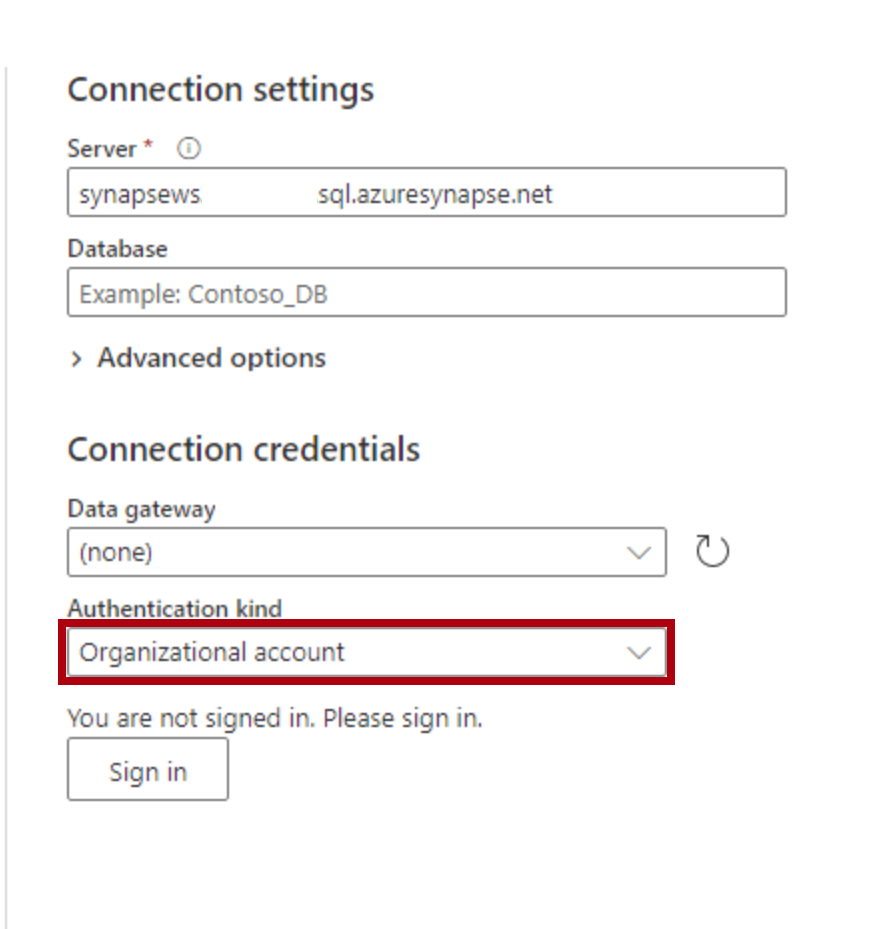
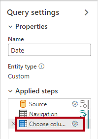
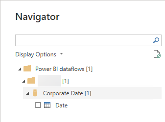

---
lab:
  title: Criação de um fluxo de dados
  module: Prepare data for tabular models in Power BI
---

# Criação de um fluxo de dados

## Visão geral

**O tempo estimado para concluir o laboratório é de 45 minutos**

Neste laboratório, você criará um fluxo de dados para fornecer dados de dimensão de data provenientes do data warehouse Azure Synapse Adventure Works. O fluxo de dados fornecerá uma definição consistente de dados relacionados a datas para uso pelos analistas de negócios da organização.

Neste laboratório, você aprenderá a:

- Usar o Power Query Online para desenvolver um fluxo de dados.

- Usar o Power BI Desktop para consumir um fluxo de dados.

## Introdução

Neste exercício, você preparará seu ambiente.

### Carregar dados no Azure Synapse Analytics

   > **Observação**: se você já tiver carregado dados no Azure Synapse Analytics usando um clone do git, ignore essa tarefa e prossiga para Configurar o **Power BI.**

1. Entre no portal do [Azure](https://portal.azure.com) usando as informações de logon localizadas na guia Recursos no lado direito da VM.
2. Use o botão **[\>_]** à direita da barra de pesquisa na parte superior da página para criar um Cloud Shell no portal do Azure, selecionando um ambiente ***PowerShell*** criando um armazenamento caso solicitado. O Cloud Shell fornece uma interface de linha de comando em um painel na parte inferior do portal do Azure, conforme mostrado aqui:

    

    > **Observação**: se você tiver criado anteriormente um cloud shell que usa um ambiente *Bash*, use o menu suspenso no canto superior esquerdo do painel do cloud shell para alterá-lo para ***PowerShell***.

3. Observe que você pode redimensionar o Cloud Shell arrastando a barra do separador na parte superior do painel ou usando os ícones **&#8212;** , **&#9723;** e **X** no canto superior direito do painel para minimizar, maximizar e fechar o painel. Para obter mais informações de como usar o Azure Cloud Shell, confira a [documentação do Azure Cloud Shell](https://docs.microsoft.com/azure/cloud-shell/overview).

4. No painel do PowerShell, insira o seguinte comando para clonar este repositório:

    ```
    rm -r dp500 -f
    git clone https://github.com/MicrosoftLearning/DP-500-Azure-Data-Analyst dp500
    ```

5. Depois que o repositório tiver sido clonado, digite os seguintes comandos para alterar para a pasta de **instalação** e executar o **script setup.ps1** contido nela:

    ```
    cd dp500/Allfiles/04
    ./setup.ps1
    ```

6. Quando solicitado, insira uma senha adequada a ser definida para seu pool de SQL do Azure Synapse.

    > **Observação**: memorize a senha!

7. Aguarde a conclusão do script – isso normalmente leva cerca de 20 minutos; mas em alguns casos pode demorar mais.

1. Depois de criar o workspace Synapse e o Pool de SQL e carregar os dados, o script pausa o pool para evitar cobranças desnecessárias do Azure. Quando estiver pronto para trabalhar com seus dados no Azure Synapse Analytics, você precisará retomar o Pool de SQL.

### Clonar o repositório para este curso

1. No menu Iniciar, abra o Prompt de Comando

    

1. Na janela do prompt de comando, navegue até a unidade D digitando:

    `d:` 

   Pressione ENTER.

    


1. Na janela do prompt de comando, digite o seguinte comando para baixar os arquivos do curso e salve-os em uma pasta chamada DP500.
    
    `
    git clone https://github.com/MicrosoftLearning/DP-500-Azure-Data-Analyst DP500
    `
   
2. Quando o repositório tiver sido clonado, feche a janela do prompt de comando. 
   
3. Abra a unidade D no explorador de arquivos para garantir que os arquivos tenham sido baixados.

### Configurar o Power BI Desktop

Nesta tarefa, você configurará o Power BI Desktop.

1. Para abrir o Explorador de Arquivos, na barra de tarefas, selecione o atalho do **Explorador de Arquivos**.

1. Navegue até a pasta **D:\DP500\Allfiles\05\Starter**.

1. Para abrir um arquivo pré-desenvolvido do Power BI Desktop, clique duas vezes no arquivo **Sales Analysis - Create a dataflow.pbix**.

1. Se ainda não tiver iniciado sessão, no canto superior direito do Power BI Desktop, selecione **Iniciar sessão**. Use as credenciais do laboratório para concluir o processo de entrada.

    

1. Para salvar o arquivo, na faixa de opções **Arquivo**, selecione **Salvar**.

1. Na janela **Salvar como**, procure a pasta **D:\DP500\Allfiles\05\MySolution**.

1. Vá para o Power BI Desktop e selecione **Arquivo**, **Opções e configurações**, **Opções**, **Segurança** e, em Navegador de autenticação, marque **Usar meu navegador da Web padrão** e selecione **Salvar.**

    *Você atualizará a solução do Power BI Desktop para usar um fluxo de dados para dados de dimensão de data de origem.*

### Entrar no serviço do Power BI

Nesta tarefa, você entrará no serviço do Power BI, iniciará uma licença de avaliação e criará um workspace.

*Importante: se você já configurou o Power BI em seu ambiente de VM, continue para a próxima tarefa.*

1. Em um navegador da Web, vá para [https://powerbi.com](https://powerbi.com/).

1. Use as credenciais do laboratório para concluir o processo de entrada.

    *Importante: você deve usar as mesmas credenciais usadas para entrar no Power BI Desktop.*

1. No canto superior direito, selecione o ícone de perfil e, em seguida, selecione **Iniciar avaliação**.

    

1. Quando solicitado, selecione **Iniciar avaliação**.


2. Execute as tarefas restantes para concluir a configuração de avaliação.

    *Dica: a experiência do navegador da Web do Power BI é conhecida como o **Serviço do Power BI**.*

9. Selecione Workspaces e **Criar um workspace**.

    

10. Crie um workspace chamado DP500 labs e selecione **Salvar**.

    *Observação: o nome do workspace deve ser exclusivo dentro do locatário. Se você estiver recebendo um erro, altere o nome do workspace.*

O workspace é criado e aberto. Em um exercício posterior, você criará um fluxo de dados para esse workspace.

### Iniciar o pool de SQL

Nesta tarefa, você iniciará o pool de SQL.

1. Em um navegador da Web, vá para [https://portal.azure.com](https://portal.azure.com/).

1. Use as credenciais do laboratório para concluir o processo de entrada.

1. Use a barra de pesquisa para localizar o Azure Synapse Analytics. 

1. Selecione a instância Azure Synapse Analytics.
    

1. Localize e selecione o pool de SQL dedicado.
    

1. Retomar o pool de SQL dedicado.

    

    *Importante: o pool de SQL é um recurso caro. Limite o uso deste recurso ao trabalhar neste laboratório. A tarefa final neste laboratório instruirá você a pausar o recurso.*

## Desenvolver um fluxo de dados

Neste exercício, você desenvolverá um fluxo de dados para dar suporte ao desenvolvimento de modelos do Power BI. Ele fornecerá uma representação consistente da tabela de dimensão de data do data warehouse.

### Examinar o modelo de dados

Nesta tarefa, você examinará o conjunto de dados especializados do Power BI Desktop.

1. Alterne para a solução Power BI Desktop.

1. À esquerda, mude para a exibição de **Modelo**.

    

1. No diagrama de modelo, observe a tabela **Data**.

    

    *A tabela **Data** foi criada pelo analista de negócios. Ele não representa uma definição consistente de dados relacionados à data e não inclui colunas de deslocamento úteis para oferecer suporte a filtros de data relativa. Em um exercício posterior, você substituirá essa tabela por uma nova tabela originada de um fluxo de dados.*

### Criação de um fluxo de dados

Nesta tarefa, você criará um fluxo de dados que representa uma definição consistente de dados relacionados à data.

1. No serviço do Power BI, selecione **Novo**, **Fluxo de Dados**.

    

1. No bloco **Definir novas tabelas**, selecione **Adicionar novas tabelas**.

    

    *Adicionar novas tabelas envolve usar o Power Query Online para definir consultas.*

1. Para escolher uma fonte de dados, selecione **Azure Synapse Analytics (SQL DW).**

    

    *Dica: você pode usar a caixa Pesquisar (localizada no canto superior direito) para ajudar a localizar a fonte de dados.*

1. Insira as configurações de Conexão do Synapse.

     - Insira o nome do servidor no Portal do Azure
     
     
     
      O nome do servidor deve ser semelhante a:
      
      synapsewsxxxxx.sql.azuresynapse.net
      
     - Garanta que o Tipo de autenticação seja **Conta organizacional**. Se você for solicitado a entrar, use as credenciais fornecidas pelo laboratório.
     

1. Na parte inferior direita, selecione **Avançar**.

    

1. No painel de navegação do Power Query, expanda o sqldw e selecione (não marque) a tabela **DimDate**.

    

1. Observe a visualização dos dados da tabela.

1. Para criar uma consulta, marque a tabela **DimDate**.

    

1. Na parte inferior direita, selecione **Transformar Dados**.

    

    *O Power Query Online agora será usado para aplicar transformações à tabela. Ele fornece uma experiência quase idêntica ao Editor do Power Query no Power BI Desktop.*

1. No painel **Configurações de Consulta** (localizado à direita), para renomear a consulta, na caixa **Nome**, substitua o texto por **Data** e clique em **Enter**.

    

1. Para remover colunas desnecessárias, na guia de faixa de opções **Página Inicial**, no grupo **Gerenciar Colunas**, selecione o ícone **Escolher Colunas**.

    

1. Na janela **Escolher Colunas**, para desmarcar todas as caixa de seleção, para desmarcar todas as caixas de seleção, desmarque a primeira caixa de seleção.

    


1. Marque as cinco colunas a seguir.

    - DateKey

    - FullDateAlternateKey

    - MonthNumberOfYear

    - FiscalQuarter

    - FiscalYear

    

1. Selecione **OK**.

    

  
1. No painel **Configurações de Consulta**, na lista **Etapas aplicadas**, observe que uma etapa foi adicionada para remover outras colunas.

    

    *O Power Query define etapas para obter a estrutura e os dados desejados. Cada transformação é uma etapa na lógica de consulta.*

1. Para renomear a coluna **FullDateAlternateKey**, clique duas vezes no cabeçalho da coluna **FullDateAlternateKey**.

1. Substitua o texto por **Data** e selecione **Enter**.

    

1. Para adicionar uma coluna calculada, na guia de faixa de opções **Adicionar Coluna**, no grupo **Geral**, selecione **Coluna Personalizada**.

    

   

1. Na janela **Coluna personalizada**, na caixa **Nome da nova coluna**, substitua o texto por **Ano**.

1. Na lista suspensa **Tipo de dados**, selecione **Texto**.

    

1. Na caixa **Fórmula de coluna personalizada**, insira a seguinte fórmula:

    *Dica: é possível copiar e colar todas as fórmulas de **D:\DP500\Allfiles\05\Assets\Snippets.txt**.*


    ```
    "FY" & Number.ToText([FiscalYear])
    ```


1. Selecione **OK**.

    *Agora você adicionará mais quatro colunas personalizadas.*

1. Adicione outra coluna personalizada chamada **Trimestre** com o tipo de dados **Texto**, usando a seguinte fórmula:


    ```
    [Year] & " Q" & Number.ToText([FiscalQuarter])
    ```


1. Adicione outra coluna personalizada chamada **Mês** com o tipo de dados **Texto**, usando a seguinte fórmula:


    ```
    Date.ToText([Date], "yyyy-MM")
    ```

1. Adicione outra coluna personalizada chamada **Deslocamento de Mês** (inclua um espaço entre as palavras) com o tipo de dados **Número inteiro**, usando a seguinte fórmula:


    ```
    ((Date.Year([Date]) * 12) + Date.Month([Date])) - ((Date.Year(DateTime.LocalNow()) * 12) + Date.Month(DateTime.LocalNow()))
    ```


    *Essa fórmula determina o número de meses a partir do mês atual. O mês atual é zero, os meses passados são negativos e os meses futuros são positivos. Por exemplo, o mês passado tem um valor de -1.*

   

1. Adicione outra coluna personalizada chamada **Filtro Deslocamento Mês** (inclua espaço entre as palavras) com o tipo de dados **Texto**, usando a seguinte fórmula:


    ```
    if [Month Offset] > 0 then Number.ToText([Month Offset]) & " month(s) future"

    else if [Month Offset] = 0 then "Current month"

    else Number.ToText(-[Month Offset]) & " month(s) ago"
    ```


    *Essa fórmula transpõe o deslocamento numérico para um formato de texto amigável.*

    *Dica: é possível copiar e colar todas as fórmulas de **D:\DP500\Allfiles\05\Assets\Snippets.txt**.*

1. Para remover colunas desnecessárias, na guia de faixa de opções **Página Inicial**, no grupo **Gerenciar Colunas**, selecione o ícone **Escolher Colunas**.

    

1. Na janela **Escolher Colunas**, para desmarcar as seguintes colunas:

    - MonthNumberOfYear

    - FiscalQuarter

    - FiscalYear

    

1. Selecione **OK**.

1. Na parte inferior direita, selecione **Salvar &amp; fechar**.

    

1. Na janela **Salvar seu fluxo de dados**, na caixa **Nome**, insira **Data Corporativa**.

1. **Na caixa Descrição**, insira: **Definição de data consistente para uso em todos os conjuntos de dados do Adventure Works**

1. Dica: é possível copiar e colar a descrição de **D:\DP500\Allfiles\05\Assets\Snippets.txt**.

    

1. Selecione **Salvar**.

    

1. No serviço do Power BI, expanda **Meu Workspace** no painel de navegação esquerdo.

    *Essa ação abre a página de destino do workspace.*

1. Para atualizar o fluxo de dados, passe o cursor sobre o fluxo de dados **Data Corporativa** e selecione o ícone **Atualizar agora**.

    

  

1. Para ir para as configurações de fluxo de dados, passe o cursor sobre o fluxo de dados **Data Corporativa**, selecione as reticências e selecione **Configurações**.

    

1. Observe as opções de configuração.

    

    *Há duas configurações que devem ser definidas. Primeiro, a atualização agendada deve ser configurada para atualizar os dados de fluxo de dados todos os dias. Dessa forma, as compensações mensais serão calculadas usando a data atual. Em segundo lugar, o fluxo de dados deve ser endossado como certificado (por um revisor autorizado). Um fluxo de dados certificado declara a outras pessoas que atende aos padrões de qualidade e pode ser considerado confiável e confiável.*

    *Além de definir as configurações, a permissão deve ser concedida a todos os criadores de conteúdo para consumir o fluxo de dados.*

## Consumir um fluxo de dados

Neste exercício, na solução Power BI Desktop, você substituirá a tabela **Data** existente por uma nova tabela que origina seus dados do fluxo de dados.

### Remover a tabela Data original

Nesta tarefa, você remover a tabela **Data** original.

1. Alterne para a solução Power BI Desktop.

1. No diagrama do modelo, clique com o botão direito na tabela **Data** e selecione **Excluir do modelo**.

    

1. Quando a solicitação para excluir a tabela for exibida, selecione **OK**.

    

  


### Adicionar uma nova tabela Data

Nesta tarefa, você adicionará uma nova tabela **Data** que origina seus dados do fluxo de dados.

1. Na faixa de opções **Página Inicial**, dentro do grupo **Dados**, selecione o ícone **dados**.

    

1. Na janela **Obter Dados**, à esquerda, selecione **Power Platform** e, em seguida, selecione **Fluxos de dados do Power BI**.

    

1. Selecione **Conectar**.

    

  

1. Na janela de **Fluxos de dados do Power BI**, selecione **Entrar**.

    

1. Use as credenciais do laboratório para concluir o processo de entrada.

    *Importante: você deve usar as mesmas credenciais usadas para entrar no serviço do Power BI.*

1. Selecione **Conectar**.

    

1. Na janela **Navegador**, no painel esquerdo, expanda a pasta do workspace e expanda a pasta de fluxo de dados **Data Corporativa**.

    


1. Marque a tabela **Data**.

    

1. Selecione **Carregar**.

    

    *É possível transformar os dados usando o Editor do Power Query.*

1. Quando a nova tabela for adicionada ao modelo, crie uma relação arrastando a coluna **DateKey** da tabela **Data** para a coluna **OrderDateKey** da tabela **Vendas**.

    

    *Há muitas outras configurações de modelo, como ocultar colunas ou criar uma hierarquia, que podem ser feitas.*

### Validar o modelo

Nesta tarefa, você testará o modelo criando um layout de relatório simples.

1. À esquerda, mude para a exibição de **Relatório**.

    

1. Para adicionar um gráfico à página, no painel **Visualizações**, selecione o de visual de gráfico de barras empilhadas.

    

1. Redimensione o visual de modo a preencher a página relatório.

  

1. No painel **Dados**, expanda a tabela **Data** e arraste o campo **Filtro de Deslocamento de Mês** para o visual do gráfico de barras.

    

1. No painel **Dados**, expanda a tabela **Vendas** e arraste o campo **Valor da Vendas** para o visual do gráfico de barras.

    


1. Para classificar o eixo vertical, no canto superior direito do visual, selecione as reticências e, em seguida, selecione **Classificar eixo** > **Filtro de Deslocamento de Mês**.

    

1. Para garantir que os valores do filtro de deslocamento de mês sejam classificados cronologicamente, no painel painel **Dados**, selecione o campo **Filtro de Deslocamento de Mês**.

1. Na guia da faixa de opções **Ferramentas de Coluna**, no grupo **Classificar**, selecione **Classificar** e em seguida **Deslocamento de Mês**.

    

1. Examine o visual atualizado do gráfico de barras que agora classifica cronologicamente.

    *O principal benefício do uso de colunas de deslocamento de data é que os relatórios podem filtrar por datas relativas de forma personalizada. (Segmentações de dados e filtros e também filtrar por períodos relativos de data e hora, mas esse comportamento não pode ser personalizado. Elas também não permitem a filtragem por trimestres.)*

1. Salve o arquivo do Power BI Desktop.

1. Feche o Power BI Desktop.

### Pausar o pool de SQL

Nesta tarefa, você parar o pool de SQL.

1. Em um navegador da Web, vá para [https://portal.azure.com](https://portal.azure.com/).

1. Localize o pool de SQL.

1. Pause o pool de SQL.
