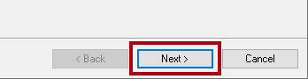
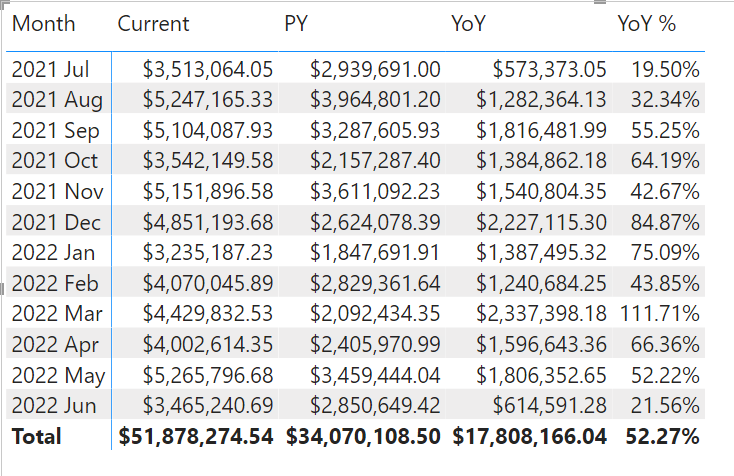
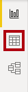

---
lab:
  title: Criar grupos de cálculo
  module: Design and build tabular models
---
# Criar grupos de cálculo

## Visão geral

O tempo estimado para concluir o laboratório é de 45 minutos

Neste laboratório, você usará o Power BI Desktop e o Editor de Tabelas 2 para criar grupos de cálculo.

Neste laboratório, você aprenderá a:

-   Criar grupos de cálculo.
-   Formatar itens de cálculo.
-   Definir a precedência de grupo de cálculo.
-   Configurar elementos visuais para usar grupos de cálculo.

## Introdução
### Clonar o repositório para este curso

1. No menu Iniciar, abra o Prompt de Comando

    

1. Na janela do prompt de comando, navegue até a unidade D digitando:

    `d:` 

   Pressione ENTER.

    


1. Na janela do prompt de comando, digite o seguinte comando para baixar os arquivos do curso e salve-os em uma pasta chamada DP500.
    
    `git clone https://github.com/MicrosoftLearning/DP-500-Azure-Data-Analyst DP500`
   
1. Quando o repositório tiver sido clonado, feche a janela do prompt de comando. 
   
1. Abra a unidade D no explorador de arquivos para garantir que os arquivos tenham sido baixados.

## Prepare o seu ambiente

Prepare seu ambiente de laboratório instalando o Editor de Tabela 2, configurando o Power BI Desktop, revisando o modelo de dados e criando medidas.

### Baixar e instalar o Editor de Tabela 2

Baixe e instale o Editor de Tabela 2 para habilitar a criação de grupos de cálculo.

**Importante:** *se você já instalou o Editor de Tabela 2 em seu ambiente de VM, continue para a próxima tarefa.*

*O Editor de Tabela é uma ferramenta de editor alternativa para criar modelos de tabela para Analysis Services e Power BI. O Editor de Tabelas 2 é um projeto de código aberto que pode editar um arquivo BIM sem acessar nenhum dado no modelo.*

1.  Verifique se o Power BI Desktop está fechado.

1.  No Microsoft Edge, navegue até a página Versão do Editor de Tabela.

    ```https://github.com/TabularEditor/TabularEditor/releases```
    
1. Role para baixo até a seção **Ativos** e selecione o arquivo **TabularEditor.Installer.msi** Isso iniciará a instalação do arquivo.

1. Após a conclusão, selecione **Abrir arquivo** para executar o instalador.

    

1.  Na janela do instalador do Editor de Tabelas, selecione **Avançar**.

    

1.  Leia o **Contrato de Licença**. Se você concordar, escolha  Aceito  e, em seguida, selecione **Avançar**.

    

1.  Na etapa **Selecionar Pasta de Instalação**, selecione **Avançar**.


2.  Na etapa **Atalhos de aplicativo**, selecione **Avançar**.


3. Na etapa **Confirmar Instalação**, selecione **Avançar**.

4. Se você receber uma janela pop-up **Controle de Conta de Usuário**, selecione **Sim.**

5. Quando a instalação for concluída, selecione **Fechar**.

    *O Editor de Tabela agora está instalado e registrado como uma ferramenta externa do Power BI Desktop.*

### Configurar o Power BI Desktop

Agora, você abrirá uma solução pré-desenvolvida do Power BI Desktop.

1.  No Explorador de Arquivos, vá para a pasta **D:\\DP500\\Allfiles\\07\\Starter**.

2.  Para abrir um arquivo pré-desenvolvido do Power BI Desktop, clique duas vezes no arquivo **Sales Analysis - Create calculation groups.pbix**.

3.  Para salvar o arquivo, na guia **Arquivo** da faixa de opções, selecione **Salvar Como**.

4.  Na janela **Salvar como**, procure a pasta **D:\\DP500\\Allfiles\\07\\MySolution**.

5.  Selecione **Salvar**.

6.  Selecione a guia **Ferramentas Externas** da faixa de opções.

    

7.  Observe que você pode iniciar o Editor de Tabela nesta guia da faixa de opções.

    

    *No próximo exercício, você usará o Editor de Tabelas para criar grupos de cálculo.*

### Examinar o modelo de dados

Examine o modelo de dados para entender como os grupos de cálculo serão aplicados a esse modelo.

1.  No Power BI Desktop, alterne para a exibição de **Modelo** à esquerda.

    

2.  Use o diagrama de modelo para examinar o design do modelo.

    

    *O modelo compreende sete tabelas de dimensões e duas tabelas de fatos. A tabela de fatos **Vendas** armazena detalhes do pedido de vendas. A tabela de fatos **Cotação de Câmbio** armazena taxas de câmbio diárias para diversas moedas. É um design clássico de esquema em estrela.*

3.  Alterne para a exibição de **Relatório**.

    

4.  No painel **Dados** (localizado à direita), expanda a tabela **Vendas** para revisar os campos.

    

5.  Observe que os dois campos da tabela **Vendas** são decorados com o símbolo sigma (∑).

    *O símbolo sigma indica que os campos serão resumidos automaticamente usando funções de agregação, como soma, contagem, média ou outras.*

    *No entanto, quando grupos de design são acrescentados a um modelo, esse comportamento automático deve ser desabilitado. Isso significa que a sumarização só pode ser alcançada por medidas, que são definidas usando fórmulas DAX (Expressões de Análise de Dados). Na próxima tarefa, você adicionará medidas ao modelo.*

### Criar medidas

Crie três medidas relacionadas a vendas em preparação para a criação de seus grupos de cálculo.

1.  No painel **Dados**, clique com o botão direito do mouse na tabela **Vendas** e selecione **Nova medida**.

    

2.  Na barra de fórmulas (localizada abaixo da faixa de opções), substitua o texto pela definição de medida a seguir e pressione **Enter**.

    Dica: é possível copiar e colar todas as fórmulas de **D:\\DP500\\Allfiles\\07\\Assets\\Snippets.txt**.

    DAX

    ```Sales = SUM ( 'Sales'[Sales Amount] )```

3.  Nas faixa de opções contextual **Ferramentas de Medida**, dentro do grupo **Formatação**, defina o número de casas decimais como **2**.

    

4.  Crie e formate de modo semelhante uma segunda medida chamada **Custo** usando a seguinte definição:

    DAX

    ```Cost = SUM ( 'Sales'[Total Product Cost] )```

5.  Crie e formate de modo semelhante uma terceira medida chamada **Lucro** usando a seguinte definição:

    DAX

    ```Profit = [Sales] - [Cost]```

6.  No painel **Dados**, clique com o botão direito do mouse na tabela **Valor de Vendas** , e selecione **Ocultar**.

    

7.  Também oculte o campo **Custo Total do Produto**.

8.  Observe que o a tabela **Vendas** agora está listada primeiro no painel **Campos** e é decorada com um ícone de várias calculadoras.

    

    *Quando uma tabela inclui apenas medidas visíveis, ela é apresentada na parte superior do painel. Dessa forma, ele se comporta como um grupo de medidas (um objeto de um modelo multidimensional). Não confunda essa representação cosmética de um modelo tabular com grupos de cálculo DAX.*

## Criar um grupo de cálculo

Agora, você criará dois grupos de cálculo. O primeiro apoiará a inteligência do tempo. O segundo apoiará a conversão de moeda.

### Criar o grupo de cálculo de Inteligência de Dados Temporais

Use o Editor de Tabelas para criar o grupo de cálculo **Inteligência de dados temporais**. Isso simplificará a criação de muitos cálculos relacionados ao tempo, incluindo PY (ano anterior), YoY (ano a ano) e YoY % (percentual ano a ano). O grupo de cálculo permitirá analisar qualquer medida utilizando diferentes cálculos de Inteligência Temporal.

*O Power BI Desktop não oferece suporte à criação ou ao gerenciamento de grupos de cálculo.*

   > **Dica**: é possível copiar e colar sintaxe de D:\DP500\Allfiles\07\Assets\Snippets.txt.

1.  Na faixa de opções **Ferramentas Externas**, selecione **Editor de Tabela**.

    

    *O Editor de Tabela é aberto em uma nova janela e se conecta ao vivo ao modelo de dados hospedado no Power BI Desktop. As alterações feitas no modelo no Editor de Tabela somente são propagadas para o Power BI Desktop quando você as salva.*

2.  Na janela **Editor de Tabelas**, no painel esquerdo, clique com o botão direito do mouse na pasta **Tabelas** , e selecione \>Criar Novo ** Grupo de Cálculo**.

    

3.  No painel esquerdo, substitua o nome padrão por **Inteligência de dados , temporais** e pressione **Enter**.

4.  Em seguida abra e expanda a tabela **Inteligência de dados temporais**.

5.  Selecione a coluna **Nome**.

    

    *O grupo de cálculo compreende essa única coluna, enquanto linhas de dados definem o grupo de cálculos. É uma prática recomendada renomear a coluna para refletir o assunto dos cálculos.*

6.  No painel **Propriedades** (localizado no canto inferior direito), selecione a propriedade **Nome**, e renomeie-a como **Cálculo de Tempo**.

    

7.  Para criar um item de cálculo, clique com o botão direito do mouse na tabela **Inteligência de dados temporais** e selecione **Criar Novo** \> **Item de Cálculo**.

    

8.  No painel esquerdo, substitua o nome padrão por **, Atual** e pressione **Enter**.

9.  No painel **Editor de Expressões** (localizado acima do painel **Propriedades**), insira a seguinte fórmula:

    DAX

    ```SELECTEDMEASURE ()```

    

    *A função SELECTEDMEASURE retorna uma referência à medida que está atualmente no contexto quando o item de cálculo é avaliado.*

10. Na barra de ferramentas do painel **Editor de Expressões**, selecione o primeiro botão para aceitar as alterações.

    

11. Crie um segundo item de cálculo chamado **PY** usando a seguinte fórmula:

    DAX

    ```CALCULATE ( SELECTEDMEASURE (), SAMEPERIODLASTYEAR ( 'Date'[Date] ) )```

    *O ano anterior (PY) calcula o valor da medida selecionada no ano anterior.*

12. Crie um terceiro item de cálculo chamado **YoY** usando a seguinte fórmula:

    DAX
    ```
    SELECTEDMEASURE () 
        - CALCULATE ( SELECTEDMEASURE (), 'Time Intelligence'[Time Calculation] = "PY" )
    ```

    *A fórmula ano a ano (YoY) calcula a diferença da medida selecionada do ano atual em relação ao ano anterior.*

13. Crie um quarto item de cálculo chamado **YoY %** usando a seguinte fórmula:

    DAX
    ```
    DIVIDE (
        CALCULATE ( SELECTEDMEASURE (), 'Time Intelligence'[Time Calculation] = "YoY" ),
        CALCULATE ( SELECTEDMEASURE (), 'Time Intelligence'[Time Calculation] = "PY" )
    )
    ```
    *A fórmula percentual ano a ano (YoY %) calcula a alteração percentual da medida selecionada ao longo do ano anterior.*

14. No painel **Propriedades**, defina a propriedade **Formatar Expressão da Cadeia de Caracteres** para: 
    ```
    "0.00%;-0.00%;0.00%"
    ```

    Dica: é possível copiar e colar a cadeia de caracteres de formato em **D:\\DP500\\Allfiles\\07\\Assets\\Snippets.txt**.

    

15. Verifique se o grupo de cálculo **Inteligência de dados temporais** tem quatro itens de cálculo.

    

16. Para salvar as alterações no modelo do Power BI Desktop, no menu **Arquivo**, selecione **Salvar**.

    

    **Dica:** *também é possível selecionar o botão da barra de ferramentas ou pressionar **Ctrl+S**.*

17. Alternar para o Power BI Desktop.

18. Acima do designer de relatório, observe a faixa amarela.

    

19. À direita da faixa, selecione **Atualizar agora**.

    

    *A atualização aplica as alterações criando o grupo de cálculo como uma tabela modelo. Em seguida, ele carrega os itens de cálculo como linhas de dados.*

20. No painel **Dados**, abra e expanda a tabela **Inteligência de Dados Temporais**.

    

### Atualizar o visual da matriz

Agora você modificará o visual da matriz para usar a coluna **Cálculo de Tempo** .

1.  No relatório, selecione o visual da matriz.

2.  No painel **Visualizações**, na caixa **Valores**, selecione **X** para remover o campo **Valor de Vendas**.

    

3.  No painel **Dados**, de dentro da tabela **Vendas**, arraste **Vendas** para dentro da caixa **Valores**.

    

4.  No painel **Dados**, de dentro da tabela **Inteligência de Dados Temporais**, arraste o campo **Cálculo de Tempo** para a caixa **Colunas**.

    

5.  Verifique se o visual da matriz mostra uma grade de valores de medida de **Vendas** relacionados ao tempo agrupados por mês.

    

    *No entanto, lembre-se de que você definiu a expressão de cadeia de caracteres de formato para a medida **YoY %** para produzir um formato de percentual.*

### Criar o grupo de cálculo de Conversão de Moeda

Agora você criará o grupo de cálculo **Conversão de Moeda**. Ele fornecerá flexibilidade para converter as medidas da tabela **Vendas** em uma moeda selecionada. Ele também aplicará a formatação apropriada para a moeda selecionada.

1.  No Power BI Desktop, mude para a exibição de **Dados**.

    

2.  No painel **Dados**, selecione a tabela **Moeda**.

3.  Observe que a coluna oculta **FormatString** que contém expressões de cadeia de caracteres de formato consistia na coluna de valores.

    

    *Você usará uma expressão DAX para aplicar a cadeia de caracteres de formato da moeda selecionada.*

4.  Alterne para o Editor de Tabelas.

5.  Criar um grupo de cálculo chamado **Conversão de Moeda**.

    *Devido à repetição de tarefas, instruções mais breves são fornecidas. Se necessário, você pode consultar as etapas na primeira tarefa deste exercício.*

    

6.  Renomeie a coluna **Nome** como **Moeda Convertida**.

    

7.  Crie um item de cálculo chamado **Conversão de Moeda** usando a seguinte fórmula:

    DAX
    ```
    IF (
        HASONEVALUE ( 'Currency'[Currency] ),
        SUMX (
            VALUES ( 'Date'[Date] ),    CALCULATE (
                DIVIDE ( SELECTEDMEASURE (), MAX ( 'Currency Rate'[EndOfDayRate] ) )
            )
        )
    )
    ```
    *Quando há apenas uma moeda no contexto de filtro, a fórmula soma os valores diários da medida selecionada que são divididos pela taxa diária do final do dia.*

8.  No painel **Propriedades**, defina a propriedade **Formatar Expressão da Cadeia de Caracteres** como a fórmula a seguir:

    DAX
    ```
    SELECTEDVALUE ( 'Currency'[FormatString] )
    ```
    Essa fórmula retorna a cadeia de caracteres de formato da moeda selecionada. Dessa forma, a formatação é controlada dinamicamente pelos dados na tabela de dimensões **Moeda**.

9.  Salve as alterações no modelo do Power BI Desktop.

10. Alterne para a área de trabalho do Power BI e atualize as alterações.

    

11. Alterne para a exibição de **Relatório**.

    

12. Selecione o visual da matriz.

13. No painel **Campos**, de dentro da tabela **Conversão de Moeda**, arraste o campo **Moeda Convertida** para o painel **Filtros**, para dentro do grupo **Filtro nesse visual**.

    

14. No cartão de filtro, verifique o valor de **Conversão de Moeda**.

    

15. Observe que os formatos de valor são atualizados para descrever claramente os valores em dólares americanos.

    

16. Na segmentação **Conversão de Moeda**, selecione uma moeda diferente e, no visual da matriz, observe os valores e formatação de atualizados.

17. Reverta a segmentação **Moeda** novamente para **Dólar Americano**.

    

18. No entanto, observe que os valores **YoY %** não são mais porcentagens.

    *Há um problema. Os grupos de cálculos de **Inteligência de Dados Temporais** e **Conversão de Moeda** são aplicados, mas a ordem de  cálculo está incorreta. Atualmente, o cálculo **YoY %** acontece, então a conversão de moeda adiciona resultados de cálculo diários ao longo do mês. Para produzir o resultado correto, a ordem de cálculo deve ser invertida. Você pode controlar a ordem de cálculo definindo valores de precedência.*

### Modificar a precedência de grupo de cálculo

Agora você modificará a precedência do grupo de cálculo dos dois grupos de cálculo.

1.  Alterne para o Editor de Tabelas.

2.  No painel esquerdo, selecione o grupo de cálculo **Inteligência de Dados Temporais**.

    

3.  No painel **Propriedades**, defina a propriedade **Precedência do Grupo de Cálculo** como **20**.

    

    *Quanto maior o valor, maior a precedência de aplicação. Assim, o grupo de cálculo com a maior precedência é aplicado primeiro.*

4.  Defina a precedência do grupo de cálculo para o grupo de cálculo **Conversão de Moeda** como **10**.

    

    *Essas configurações garantirão que os cálculos de **Inteligência de Dados Temporais** aconteçam mais tarde.*

5.  Salve as alterações no modelo do Power BI Desktop.

6.  Alternar para o Power BI Desktop.

7.  Observe que os valores **YoY %** agora são porcentagens.

    

### Conclusão

Nesta tarefa, você vai concluir.

1.  Salve o arquivo do Power BI Desktop.

    

2.  Feche o Power BI Desktop.

3.  Feche o Editor de Tabela.
