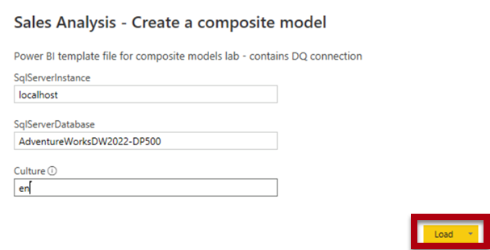
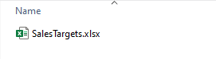
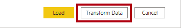
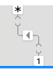

---
lab:
  title: Você cria um modelo de dados composto.
  module: Design and build tabular models
---

# Você cria um modelo de dados composto.

## Visão geral

**O tempo estimado para a conclusão do laboratório é de 30 minutos.**

Neste laboratório, você criará um modelo composto adicionando uma tabela a um modelo DirectQuery pré-desenvolvido.

Neste laboratório, você aprenderá a:

- Criar um modelo de dados composto.

- Criar relações de modelo.

- Criar medidas.

## Introdução

Neste exercício, você preparará seu ambiente.

### Clonar o repositório para este curso

1. No menu Iniciar, abra o Prompt de Comando

    

1. Na janela do prompt de comando, navegue até a unidade D digitando:

    `d:` 

   Pressione ENTER.

    


1. Na janela do prompt de comando, digite o seguinte comando para baixar os arquivos do curso e salve-os em uma pasta chamada DP500.
    
    `git clone https://github.com/MicrosoftLearning/DP-500-Azure-Data-Analyst DP500`
   
1. Quando o repositório tiver sido clonado, feche a janela do prompt de comando. 
   
1. Abra a unidade D no explorador de arquivos para garantir que os arquivos tenham sido baixados.

### Configurar o Power BI Desktop

Nesta tarefa, você abrirá uma solução pré-desenvolvida do arquivo do modelo do Power BI Desktop.

1. Para abrir o Explorador de Arquivos, na barra de tarefas, selecione o atalho do **Explorador de Arquivos**.

2. Procure a pasta **D:\DP500\Allfiles\08\Starter**.

3. Para abrir um arquivo pré-desenvolvido do Power BI Desktop, clique duas vezes no arquivo **Sales Analysis - Create a composite model.pbit**. 

4. Se for solicitado a aprovar um potencial risco de segurança, selecione **OK.**

5. Insira SQLServerInstance, SqlServerDatabase e Culture conforme fornecido abaixo. Selecione **Carregar**.

    SqlServerInstance = ```localhost```

    SqlServerDatabase = ```AdventureWorksDW2022-DP500```

    Culture = ```en```

    

6. No prompt de conexão do banco de dados do SQL Server, selecione **Conectar**.

7. Na janela Suporte à criptografia, selecione **OK.**

8. Na janela Consulta de Banco de Dados Nativo, selecione **Executar**.

9. Salve o arquivo. No menu **Arquivo**, clique em **Salvar Como**.

10. Na janela **Salvar como**, procure a pasta **D:\DP500\Allfiles\08\MySolution**. O nome do arquivo é **Sales Analysis – Create a composite model.pbix**.

11. Selecione **Salvar**.

### Revisar o relatório

Nesta tarefa, você examinará o relatório pré-desenvolvido.

1. No Power BI Desktop, no canto inferior direito da barra de status, observe que o modo de armazenamento é DirectQuery.

    

    *Um modelo DirectQuery compreende tabelas que usam o modo de armazenamento DirectQuery. Uma tabela que usa o modo de armazenamento DirectQuery passa consultas para a fonte de dados subjacente. Os modeladores de dados geralmente usam esse modo de armazenamento para modelar grandes volumes de dados. Neste caso, a fonte de dados subjacente é um banco de dados do SQL Server.*

1. Revise o design do relatório.

    

    *Esta página de relatório tem um título e dois recursos visuais. O visual da segmentação permite filtrar por um único ano fiscal, enquanto o visual do gráfico de colunas exibe os valores de vendas trimestrais. Você melhorará esse design adicionando metas de vendas ao visual do gráfico de colunas.*

1. Na segmentação **Ano Fiscal**, selecione **FY2021**.

    

    *É importante entender que as seleções de segmentação de dados alteram os filtros aplicados ao visual do gráfico de colunas. O Power BI atualiza o visual do gráfico de colunas. Isso envolve recuperar dados do banco de dados de origem. Dessa forma, o visual do gráfico de colunas mostra os dados de origem mais recentes. (Pode ocorrer algum cache em nível de relatório, o que significa que o relatório pode reutilizar dados consultados anteriormente.)*

### Examinar o modelo de dados

Nesta tarefa, você examinará o modelo de dados pré-desenvolvido.

1. Alterne para a exibição de **Modelo**.

    

1. Use o diagrama de modelo para examinar o design do modelo.

    

    *O modelo compreende três tabelas de dimensões e uma tabela de fatos. A tabela de fatos **Vendas** representa os detalhes do pedido de vendas. É um design clássico de esquema em estrela. A barra na parte superior de cada tabela indica que ela usa o modo de armazenamento DirectQuery. Como cada tabela tem uma barra azul, ela indica que todas as tabelas pertencem ao mesmo grupo de origem.*

    *Você estenderá o modelo com outra tabela de fatos para apoiar a análise de fatos de metas de vendas também.*

## Você cria um modelo de dados composto.

Neste exercício, você adicionará uma tabela de importação que converterá o modelo DirectQuery em um modelo composto.

*Um modelo composto contém mais de um grupo de origem.*

### Adicionar uma tabela

Nesta tarefa, você adicionará uma tabela que armazena metas de vendas provenientes de uma pasta de trabalho do Excel.

1. Na guia de faixa de opções **Página Inicial**, no grupo **Dados**, selecione **Pasta de trabalho do Excel**.

    

1. Na janela **Abrir**, procure a pasta **D:\DP500\Allfiles\08\Assets**.

1. Selecione o arquivo **SalesTargets.xlsx**

    

1. Selecione **Abrir**.

    

1. **Na janela Navegador**, marque a tabela **Metas**.

    

1. No painel de visualização (localizado à direita), observe que a tabela é composta por três colunas, e cada linha da tabela representa um trimestre fiscal, uma região de vendas e um valor de meta de vendas.

    

    *Você importará esses dados para adicionar uma tabela ao modelo DirectQuery. Como não é possível se conectar a uma pasta de trabalho do Excel usando o DirectQuery, o Power BI os importará.*

1. Selecione **Transformar Dados**.

    

1. Na janela do Editor do Power Query, para renomear a primeira coluna, clique duas vezes no cabeçalho da coluna **Período** .

1. Renomeie a coluna como **Trimestre Fiscal** e pressione **Enter**.

    

1. Para modificar o tipo de dados da terceira coluna, no cabeçalho da coluna **Valor da Meta**, selecione o ícone de tipo de dados (123) e selecione **Número Decimal Fixo**.

    

1. Na guia **Página Inicial** da faixa de opções, dentro do grupo **Fechar**, selecione o ícone **Fechar &amp; Aplicar**.

    

1. Se for avisado sobre um possível risco de segurança, leia a mensagem e selecione **OK.**

    

1. No Power BI Desktop, quando o processo de carregamento for concluído, no diagrama de modelo, posicione a nova tabela diretamente abaixo da tabela **Data do Pedido**.

    *A tabela pode estar fora de exibição. Se esse for o caso, role horizontalmente para revelar a tabela.*

    

1. Observe que a tabela **Metas** não tem uma barra azul na parte superior.

    *A ausência de uma barra indica que a tabela pertence ao grupo de origem de importação.*

### Criar relações de modelo

Nesta tarefa, você criará relações de modelo.

1. Para criar uma relação, na **tabela Território de Vendas**, arraste a coluna **Região** e solte-a na coluna **Região** da tabela **Metas**.

    

1. Na janela **Criar relacionamento**, observe que a lista suspensa **Cardinalidade** está definida como **Um para muitos**.

    *A coluna **Região** na tabela **Território de Vendas** contém valores exclusivos, enquanto a coluna **Região** na tabela **Metas** contém valores duplicados. Essa cardinalidade um para muitos é comum para relações entre tabelas de dimensões e de fatos.*

1. Selecione **OK**.

    

1. No diagrama do modelo, observe que agora existe uma relação entre as tabelas **Território de Vendas** e **Meta**.

1. Observe também que a linha de relação parece diferente das outras linhas de relação.

    

    *A linha "desconectado" indica que a relação é limitada. Uma relação de modelo é limitada quando não há "um" lado garantido. Nesse caso, é porque a relação abrange grupos de origem. No momento da consulta, a avaliação de relação pode diferir para relações limitadas. Para obter mais informações, consulte [Relações limitadas](https://docs.microsoft.com/power-bi/transform-model/desktop-relationships-understand).*

1. Crie outra relação, desta vez relacionando a coluna **Trimestre Fiscal** da tabela **Data do Pedido** à coluna **Trimestre Fiscal** da tabela **Metas**.

    

1. Na janela **Criar relação**, observe que a lista suspensa **Cardinalidade** está definida como **Muitos para muitos**.

    *Como ambas as colunas contêm valores duplicados, o Power BI Desktop define automaticamente a cardinalidade de muitos para muitos. No entanto, a direção padrão do filtro cruzado está incorreta.*

1. Na lista suspensa **Direção do filtro cruzado**, selecione **Único (Data do pedido filtra Destinos)**.

    

    *É comum que as tabelas de dimensão filtrem tabelas de fatos. Nesse design de modelo, não é necessário (ou eficiente) propagar filtros da tabela de fatos para a tabela de dimensões.*

1. Selecione **OK**.

    

### Definir propriedades do modelo

Nesta tarefa, você definirá as propriedades do modelo da nova tabela.

1. Na tabela **Metas**, selecione a coluna **Trimestre Fiscal**.

1. Ao pressionar a tecla **CTRL**, selecione também a coluna **Região**.

1. No painel **Propriedades**, defina a propriedade **Está oculto** como **Sim**.

    

1. Na tabela **Metas**, selecione a coluna **Valor da Meta**.

1. No painel **Propriedades**, na seção **Formatação**, defina a propriedade **Casas Decimais** para **2**.

    

### Adicionar medidas

Nesta tarefa, você adicionará duas medidas para permitir a análise da variação da meta de vendas.

1. Alterne para a exibição de **Relatório**.

    

1. Para criar uma medida, no painel **Dados** (localizado à direita), clique com o botão direito do mouse na tabela **Metas** e selecione **Nova medida**.

    

1. Na barra de fórmula, insira a definição de medida a seguir.

    *Dica: todas as definições de medidas estão disponíveis para copiar e colar no arquivo * **D:\DP500\Allfiles\08\Assets\Snippets.txt** *.*


    ```
    Variance = SUM ( 'Sales'[Sales Amount] ) - SUM ( 'Targets'[Target Amount] )
    ```


    *A medida denominada **Variância** subtrai a soma do **Valor da Meta** da soma do **Valor das Vendas**.*

1. Na guia contextual **Ferramentas de Medida** da faixa de opções, dentro do grupo **Formatação**, defina o número de casas decimais como **2**.

    

1. Crie outra medida usando a seguinte definição de medida.


    ```
    Variance Margin =

    DIVIDE (

    [Variance],

    SUM ( 'Targets'[Target Amount] )

    )
    ```


    *A medida denominada **Margem da Variação** usa a função DAX [DIVIDE](https://docs.microsoft.com/dax/divide-function-dax) para dividir a medida **Variação** pela soma da coluna **Valor da Meta**.*

1. Na guia contextual **Ferramentas de Medição** da faixa de opções, de dentro do grupo **Formatação**, na lista suspensa **Formatar**, selecione **Porcentagem**.

    

1. **No painel Dados**, dentro da tabela **Metas**, verifique se há duas medidas.

    

### Atualizar o layout do relatório

Nesta tarefa, você atualizará o relatório para usar as novas medidas.

1. No relatório, selecione o visual da gráfico de colunas.

1. No painel **Dados**, arraste o campo **Valor da Meta** para o painel **Visualizações**, dentro da caixa **Valores**, diretamente abaixo do campo **Valores das Vendas**.

    

1. Observe que o visual do gráfico de colunas agora mostra as vendas e os valores da meta.

1. Arraste as duas medidas para a caixa **Dicas de Ferramentas**.

    

1. Passe o cursor sobre qualquer coluna para revelar uma dica de ferramenta e observe que ela mostra os valores de medida.

    

    *Agora você concluiu a criação de um modelo composto que combina DirectQuery e tabelas de importação. Você pode otimizar o modelo para melhorar o desempenho da consulta definindo tabelas de dimensão para usar o modo de armazenamento duplo e adicionando agregações. No entanto, essas melhorias serão o objetivo de aprendizagem de outros laboratórios.*

### Conclusão

Nesta tarefa, você vai concluir.

1. Salve o arquivo do Power BI Desktop.

    

1. Feche o Power BI Desktop.
