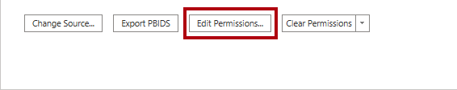
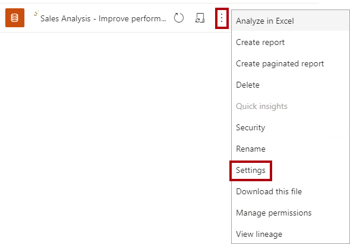
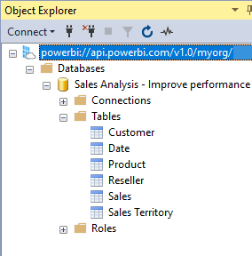

---
lab:
  title: Aprimorar o desempenho com tabelas híbridas
  module: Optimize enterprise-scale tabular models
---

# Aprimorar o desempenho com tabelas híbridas

## Visão geral

**O tempo estimado para concluir o laboratório é de 45 minutos**

Neste laboratório, você configurará a atualização incremental e habilitará uma partição DirectQuery para fornecer atualizações em tempo real e melhorar o desempenho de atualização e consulta.

Neste laboratório, você aprenderá a:

- Usar atualização incremental

- Examinar as partições da tabela.

## Introdução

Neste exercício, você preparará seu ambiente.

### Clonar o repositório para este curso

1. No menu Iniciar, abra o Prompt de Comando.

    

1. Na janela do prompt de comando, navegue até a unidade D digitando:

    `d:` 

   Pressione ENTER.

    

1. Na janela do prompt de comando, digite o seguinte comando para baixar os arquivos do curso e salve-os em uma pasta chamada DP500.
    
    `git clone https://github.com/MicrosoftLearning/DP-500-Azure-Data-Analyst DP500`
   
1. Quando o repositório tiver sido clonado, abra a unidade D no explorador de arquivos para garantir que os arquivos tenham sido baixados. **Feche a janela do Prompt de Comando**.

### Implantar um Banco de Dados SQL do Azure 

Nesta tarefa, você criará um banco de dados SQL do Azure que usará como fonte de dados para o Power BI. A execução do script de instalação criará o servidor de banco de dados SQL do Azure e carregará o banco de dados AdventureWorksDW2022.

1. Para abrir o Explorador de Arquivos, na barra de tarefas, selecione o atalho do **Explorador de Arquivos**.

2. Vá para a pasta **D:\DP500\Allfiles\10**.

3. Clique duas vezes para abrir o script de arquivos **setup2.ps1**.
    - Leia o script no bloco de notas se estiver interessado em entender quais recursos o script está configurando. As linhas que começam com # denotam o que o script está fazendo.
    - Feche o script.

5. Na caixa de pesquisa na barra de tarefas, digite `PowerShell`.  
   
   Quando os resultados da pesquisa forem exibidos, selecione **Executar como administrador**
    
    *Quando solicitado, selecione Sim para permitir que esse aplicativo altere seu dispositivo.*
1. No PowerShell, insira as 2 linhas de texto a seguir para executar o script. 
    
    ` cd D:\DP500\Allfiles\10`

    Pressione **Enter**.

    `.\setup2.ps1`
    
    Pressionar **Enter**

    

2. Quando solicitado, insira seu **nome de usuário da conta do Azure**,**senha** e **nome de grupo de recurso**. Pressione **Enter**. 

    

    A execução do script levará aproximadamente de 10-15 minutos.

    *Observação: este laboratório requer um grupo de recursos para criar um banco de dados SQL do Azure. Se você estiver executando esse laboratório em um ambiente de laboratório hospedado, talvez seja necessário fazer logon no [Portal do Azure](portal.azure.com) para obter o nome do grupo de recursos. Se você não tiver um grupo de recursos fornecido em um ambiente de laboratório hospedado, [crie um grupo de recursos](https://docs.microsoft.com/azure/azure-resource-manager/management/manage-resource-groups-portal#create-resource-groups) em sua assinatura do Azure.*

3. Após a conclusão do script, feche a janela do PowerShell.

### Configurar no Banco de Dados SQL do Azure

Nesta tarefa, você configurará o Banco de Dados SQL do Azure para permitir conexões do endereço IP da máquina virtual (VM). Esse script levará cerca de 10 minutos para ser executado depois que você inserir seu nome de usuário, senha e grupo de recursos.

1. Em um navegador da Web, vá para [https://portal.azure.com](https://portal.azure.com/).

2. Se for solicitado a fazer um tour, selecione **Talvez mais tarde**.

    

3. Selecione o bloco **bancos de dados SQL**.

    

4. Na lista de bancos de dados SQL, selecione o banco de dados **AdventureWorksDW2022-DP500**.

5. Na barra de ações na guia Visão geral, selecione **Definir firewall do servidor**.

    

6. Na guia de acesso público, selecione Redes selecionadas.

7. Selecione **Adicionar o endereço IPv4 do cliente**.

    

7. Selecione **Salvar**.

    

8. Mantenha a sessão do navegador da Web do portal do Azure aberta. Você precisará copiar a cadeia de conexão do banco de dados na tarefa **Configurar o Power BI Desktop**.

### Configurar Power BI

#### Configurar uma conta do Power BI no Power BI Desktop

Nesta tarefa, você configurará o Power BI Desktop.

1. Para abrir o Explorador de Arquivos, na barra de tarefas, selecione o atalho do **Explorador de Arquivos**.

    

1. Procure a pasta **D:\DP500\Allfiles\10\Starter**.

1. Para abrir um arquivo pré-desenvolvido do Power BI Desktop, clique duas vezes no arquivo **Sales Analysis - Improve performance with hybrid tables**.

1. Se ainda não tiver iniciado sessão, no canto superior direito do Power BI Desktop, selecione **Iniciar sessão**. Use as credenciais do laboratório para concluir o processo de entrada.

    

    *Observação: isso provavelmente abrirá o serviço do Power BI para que você conclua o processo de logon.*

1. Para salvar o arquivo, na faixa de opções **Arquivo**, selecione **Salvar**.

1. Na janela **Salvar como**, procure a pasta **D:\DP500\Allfiles\10\MySolution**.

#### Configurar a avaliação do Power BI

Nesta tarefa, você entrará no serviço do Power BI, iniciará uma licença de avaliação.

*Importante: se você já configurou o Power BI em seu ambiente de VM, continue para a próxima tarefa.*

1. Em um navegador da Web, vá para [https://powerbi.com](https://powerbi.com/).

2. Use as credenciais do laboratório para concluir o processo de entrada.

3. No canto superior direito, selecione o ícone de perfil e, em seguida, selecione **Iniciar avaliação**.

    

4. Quando solicitado, selecione **Iniciar avaliação**.

    

    *Você precisa de uma licença do Power BI Premium por Usuário (PPU) para concluir este laboratório. Uma licença de avaliação é suficiente.*

5. Execute as tarefas restantes para concluir a configuração de avaliação.

    *Dica: a experiência do navegador da Web do Power BI é conhecida como o **Serviço do Power BI**.*

### Criar um workspace

Nesta tarefa, você criará um workspace.

1. No serviço do Power BI, para criar um workspace, no painel **Navegação** (localizado à esquerda), selecione **Workspaces** e, em seguida, selecione **Criar workspaces**.

    

2. No painel **Criar um workspace** (localizado à direita), na caixa **Nome do workspace**, digite um nome para o workspace.

    *O nome do workspace precisa ser exclusivo dentro do locatário.*

    

3. Abaixo da caixa **Descrição**, expanda para abrir a seção **Avançado**.

    

4. Defina a opção **Modo de licença** como **Premium por usuário**.

    

    *O Power BI só dá suporte a atualização incremental e tabelas híbridas em workspaces Premium.*

5. Selecione **Salvar**.

    

    *Depois de criado, o serviço do Power BI abre o workspace. Você retornará a esse workspace mais tarde neste laboratório.*

### Configurar o Power BI Desktop

Nesta tarefa, você abrirá uma solução pré-desenvolvida do Power BI Desktop, definirá as configurações e permissões da fonte de dados e atualizará o modelo de dados.

1. Para abrir o Explorador de Arquivos, na barra de tarefas, selecione o atalho do **Explorador de Arquivos**.

    

2. Procure a pasta **D:\DP500\Allfiles\10\Starter**.

3. Para abrir um arquivo pré-desenvolvido do Power BI Desktop, clique duas vezes no arquivo **Sales Analysis - Improve performance with hybrid tables.pbix**.

4. Para editar a fonte de dados do banco de dados, na guia da faixa de opções **Página Inicial**, dentro do grupo grupo **Consultas**, selecione a lista suspensa **Transformar dados** e selecione **Configurações da fonte de dados**.

    

5. Na janela **Configurações da fonte de dados**, selecione **Alterar Origem**.

    

6. Na janela do **banco de dados do SQL Server**, na caixa **Servidor**, substitua o texto pelo servidor do Banco de Dados SQL do Azure de laboratório. Isso está localizado no portal do Azure, bancos de dados SQL.

    

7. Selecione **OK**.

    

8. Selecione **Editar Permissões**.

    

9. Na janela **Editar Permissões**, para editar as credenciais do banco de dados, selecione **Editar**.

    

10. Na janela do **banco de dados do SQL Server**, insira o nome de usuário e a senha do banco de dados do SQL Server e salve. 

    Nome de usuário: `sqladmin`

    Senha: `P@ssw0rd01`

    

11.  Selecione **OK**.
    

12. Na janela **Configurações da fonte de dados**, selecione **Fechar**.

    

13. Na guia **Página Inicial** da faixa de opções, dentro do grupo **Área de Consultas**, selecione **Atualizar**.

    

14. Aguarde até que a atualização de dados seja concluída.

15. Para salvar o arquivo, na guia **Arquivo** da faixa de opções, selecione **Salvar Como**.

16. Na janela **Salvar como**, procure a pasta **D:\DP500\Allfiles\10\MySolution**.

17. Selecione **Salvar**.

18. Se ainda não tiver iniciado sessão, no canto superior direito do Power BI Desktop, selecione **Iniciar sessão**. Use as credenciais do laboratório para concluir o processo de entrada.

    *Importante: você deve usar as mesmas credenciais usadas para entrar no serviço do Power BI.*

    

### Revisar o relatório

Nesta tarefa, você examinará o relatório pré-desenvolvido.

1. Criar um relatório no Power BI Desktop

    

    *A página do relatório tem um título e dois recursos visuais. O visual do slicer permite filtrar por um único ano fiscal, enquanto o visual do gráfico de barras exibe os valores de vendas mensais. Neste laboratório, você melhorará o desempenho do relatório configurando a atualização incremental e uma tabela híbrida.*

### Examinar o modelo de dados

Nesta tarefa, você examinará o modelo de dados pré-desenvolvido.

1. Alterne para a exibição de **Modelo**.

    

2. Use o diagrama de modelo para examinar o design do modelo.

    

    *O modelo compreende cinco tabelas de dimensões e uma tabela de fatos. Cada tabela usa o modo de armazenamento de importação. A tabela de fatos **Vendas** representa os detalhes do pedido de vendas. É um design clássico de esquema em estrelas.*

    *Neste laboratório, você configurará a tabela **Vendas** para usar a atualização incremental e se tornar uma tabela híbrida. Uma tabela híbrida inclui uma partição DirectQuery que representa o período de tempo mais recente. Essa partição garante que os dados atuais da fonte de dados estejam disponíveis nos relatórios do Power BI.*

## Usar atualização incremental

Neste exercício, você configurará a atualização incremental.

*A atualização incremental estende as operações de atualização agendadas, proporcionando criação e gerenciamento automatizados de partições para tabelas de conjunto de dados que frequentemente carregam dados novos e atualizados. Ela ajuda a reduzir o tempo de atualização, reduzindo a carga sobre os dados de origem e o Power BI. Ela também pode ajudar a exibir dados atuais para o relatório do Power BI mais rapidamente.*

### Adicionar parâmetros

Nesta tarefa, você adicionará dois parâmetros.

1. Para abrir a janela do Editor do Power Query, na guia **Página Inicial** da faixa de opções, dentro do grupo **Consultas**, selecione o ícone **Transformar dados**.

    

2. Na janela do Editor do Power Query, no painel **Consultas**, selecione a consulta **Vendas**.

    

3. No painel de visualização, observe a coluna **OrderDate**, que é uma coluna de data/hora.

    *A atualização incremental requer que a tabela contenha uma coluna de data de data/hora ou tipo de dados inteiro com o valor formatado como aaaammdd.*

    *Para configurar a atualização incremental, você deve criar parâmetros que o Power BI usará para filtrar essa coluna para criar partições de tabela.*

4. Para criar um parâmetro, na guia da faixa de opções **Página Inicial**, selecione o ícone **Parâmetros do Gerenciador**.

    

5. Na janela **Gerenciar Parâmetros**, selecione **Novo**.

    

6. Na caixa **Nome**, substitua o texto por **RangeStart**.

7. Na lista suspensa **Tipo**, selecione **Data/Hora**.

8. Na caixa **Valor Atual**, insira **6/1/2022** (01 de junho de 2022 – a VM usa formatos de data dos EUA). 

    *Observe que para locais de formato que não são DD-MM-AAA, a data deve ser inserida como 1/6/2022*

    *Ao configurar os parâmetros, você pode usar valores arbitrários. O Power BI atualizará os valores de parâmetro quando criar e gerenciar as partições. Neste laboratório, você definirá um intervalo para o mês de junho de 2022.*

    

9. Para criar um segundo parâmetro, selecione **Novo**.

10. Defina as seguintes propriedades de parâmetro:

    - Nome: **RangeEnd**

    - Tipo: **Data/Hora**

    - Valor atual: **7/1/2022 (1 de julho de 2022** )

     *Observe que para locais de formato que não são DD-MM-AAA, a data deve ser inserida como 7/1/2022*

    

11. Selecione **OK**.

    

### Filtrar a consulta

Nesta tarefa, você adicionará filtros à consulta **Vendas**.

1. No painel **Consultas**, selecione a consulta **Vendas**.

2. No cabeçalho da coluna **OrderDate**, selecione a seta para baixo e, em seguida, **Filtros de Data/Hora** > **Entre**.

    

3. Na janela **Filtrar Linhas**, selecione a primeira lista suspensa de ícones de calendário e selecione **Parâmetro**.

    

4. Na lista suspensa adjacente, observe que o parâmetro **RangeStart** está definido.

    *A seleção de parâmetro padrão é a correta.*

5. Na segunda lista suspensa "intervalo", selecione **é antes de**.

    

6. Nas listas suspensas correspondentes, selecione o parâmetro **RangeEnd**.

    

7. Selecione **OK**.

    

8. Na guia **Página Inicial** da faixa de opções, dentro do grupo **Fechar**, clique no ícone **Fechar &amp; Aplicar**.

    

9. Observe que o Power BI Desktop carregou 5.134 linhas na tabela **Vendas**.

    

    *Essas são as linhas filtradas para junho de 2022.*

10. Salve o arquivo do Power BI Desktop.

    

### Usar atualização incremental

Nesta tarefa, você configurará a política de atualização incremental para a tabela **Vendas**.

1. No diagrama do modelo, clique com o botão direito no cabeçalho da tabela **Vendas** e selecione **Atualização incremental**.

    

2. Na janela **Atualização incremental e dados em tempo real**, na etapa 2, ative a atualização incremental.

    

3. Defina o seguinte: arquivar dados a partir de **2 anos** antes da data de atualização.

    

    *Essa configuração determina o período histórico. Neste caso, o Power BI criará duas partições de ano inteiro para dados históricos.*

4. Defina o seguinte: atualize incrementalmente os dados a partir de **7 dias** antes da data de atualização.

    

    *Essa configuração determina o período de atualização incremental no qual todas as linhas com uma data/hora nesse período são incluídas na(s) partição(ões) de atualização e atualizadas com cada operação de atualização.*

5. Na etapa 3, marque a opção **Obter os dados mais recentes em tempo real com DirectQuery**.

    

    *Essa configuração permite buscar as alterações mais recentes da tabela selecionada na fonte de dados além do período de atualização incremental usando DirectQuery. Todas as linhas com uma data/hora posterior ao período de atualização incremental são incluídas em uma partição DirectQuery e buscadas na fonte de dados com cada consulta de conjunto de dados. Essa configuração torna a tabela uma tabela híbrida porque ela conterá partições de importação e uma partição DirectQuery.*

6. Selecione **Aplicar**.

    

7. Salve o arquivo do Power BI Desktop.

    

### Publicar conjuntos de dados

Nesta tarefa, você publicará o conjunto de dados.

1. Para publicar o relatório, na guia **Página Inicial** da faixa de opções, selecione **Publicar**.

    

2. Na janela **Publicar no Power BI**, selecione o workspace criado neste laboratório e selecione.

    

3. Quando a publicação for bem-sucedida, selecione **Entendi**.

    

4. Feche o Power BI Desktop.

5. Se solicitado a salvar as alterações, selecione **Salvar**.

    

### Configurar o conjunto de dados

Nesta tarefa, você configurará as credenciais da fonte de dados e atualizará o conjunto de dados.

1. Alterne para a sessão do navegador da Web do serviço Power BI.

2. Na página inicial do workspace, localize o relatório e o conjunto de dados.

    

3. Passe o cursor sobre o conjunto de dados e, quando as reticências forem exibidas, selecione-as e, em seguida, selecione **Configurações**.

    

4. Na seção **Credenciais da fonte de dados**, selecione o link **Editar credenciais**.

    

5. Na janela, insira o nome de usuário e a senha e defina o nível de privacidade como Organizacional.
       
    Nome de usuário: `sqladmin`

    Senha: `P@ssw0rd01`

    

6. Selecione **Entrar.**

    

8. Em Configurações de conjunto de dados, expanda **Atualização agendada e otimização de desempenho**.

    

9. Observe mas não altere nenhuma das configurações.

    *Em uma configuração real, você agenda a atualização de dados para permitir que o Power BI atualize e gerencie as partições de forma recorrente.*

    *Neste laboratório, você fará uma atualização sob demanda.*

10. **No painel de navegação (localizado à esquerda), selecione seu workspace**.

11. Na página inicial do workspace, passe o cursor sobre o conjunto de dados e selecione o ícone **Atualizar**.

    

12. **Na coluna Atualizado**, observe o ícone girando e aguarde até que ele pare (indicando que a atualização foi concluída).

    

13. Para abrir as configurações do workspace, no canto superior direito, selecione **Configurações**.

    

14. No painel **Configurações**, selecione a guia **Premium**.

    

15. Selecione o ícone **Copiar** para copiar a cadeia de conexão.

    

    *Você usará a conexão do workspace para se conectar a ele no SQL Server Management Studio (SSMS).*

16. Para fechar o painel, selecione **Cancelar**.

    

### Examinar as partições da tabela

Nesta tarefa, você usará o SSMS para examinar as partições de tabela.

1. Para abrir o SSMS, na barra de tarefas, clique no atalho do **SSMS**.

    

2. Na janela **Conectar ao Servidor** , selecione **Analysis Services** na lista suspensa **Tipo de servidor** .

    

    *Você pode usar o SSMS para se conectar ao workspace usando o ponto de extremidade de leitura/gravação XMLA. O ponto de extremidade só está disponível para workspaces Premium.*

3. Na caixa **Nome do servidor**, substitua o texto colando na conexão do workspace (pressione **Ctrl+V**).

4. **Na lista suspensa Autenticação**, selecione **Azure Active Directory – Senha**.

5. Insira suas credenciais de laboratório.

6. Selecione **Conectar**.

    

7. No Pesquisador de Objetos (localizado à esquerda), expanda abra a pasta **Bancos de Dados**, expanda abra o banco de dados **Análise de Vendas...** (conjunto de dados) e, em seguida, a pasta **Tabelas**.

    

8. Clique com o botão direito do mouse na tabela **Vendas** e selecione **Partições**.

    

9. Na janela **Partições**, observe a lista de partições para o histórico de dois anos, seguido por partições trimestrais e diárias.

10. Role até a parte inferior da lista e observe que a última é uma partição DirectQuery para as datas atuais e futuras.

    *O Power BI cria e gerencia todas essas partições automaticamente.*

11. Selecione **Cancelar**.

    

## Testar a tabela híbrida

Neste exercício, você abrirá o relatório, adicionará um pedido de venda e verá a atualização de dados do relatório.

### Abra o relatório

Nesta tarefa, você abrirá o relatório.

1. Alterne para a sessão do navegador da Web do serviço Power BI.

2. Na página inicial do workspace, selecione o relatório.

    

3. Se necessário, na segmentação de dados **Ano Fiscal**, selecione o ano fiscal que contém o mês atual (com base na data de hoje).

    *O mês atual deve estar visível como uma barra no gráfico de barras.*

    *Observe que agosto de 2022 em diante não está no ano fiscal de 2022, que é o padrão para a segmentação.*

### Adicionar um pedido ao banco de dados

Nesta tarefa, você adicionará um pedido ao banco de dados.

1. Alterne para o SSMS.

2. Para abrir um arquivo de script, no menu **Arquivo**, selecione **Abrir**** > Arquivo.**

3. Na janela **Abrir arquivo**, procure a pasta **D:\DP500\Allfiles\10\Assets**.

4. Selecione o arquivo **1-InsertOrder.sql** e **Abrir**.

    

5. Na janela **Conectar ao Mecanismo de Banco de Dados**, garanta que a lista suspensa **Nome do servidor** esteja definida para o laboratório do servidor de Banco de Dados Azure SQL.

6. Na lista suspensa **Autenticação**, selecione **Autenticação do SQL Server**.

7. Insira o nome do usuário **sqladmin** e a senha.

8. Selecione **Conectar**.

    

9. Revise o script.

    *Esse script insere um único pedido na tabela **FactInternetSales** usando hoje como a data do pedido.*

10. Para executar um script, na barra de ferramentas, selecione **Executar** (ou pressione **F5**).

    

11. Para fechar o arquivo, no menu **Arquivo**, clique em **Fechar**.

### Atualize o relatório

Nesta tarefa, você atualizará o relatório.

1. Alterne para a sessão do navegador da Web do serviço Power BI.

2. No relatório, anote o valor das vendas do mês atual.

3. Na barra de ação, selecione o comando **Refresh**.

    

4. Quando a atualização do relatório for concluída, verifique se o valor das vendas do mês atual aumentou em US$ 10.000.

    *Quando o Power BI consultou a tabela **Vendas**, ele recuperou dados atuais da partição DirectQuery, que consultou o banco de dados SQL do Azure diretamente.*

    *Dica: as tabelas híbridas funcionam especialmente bem com a atualização automática de página, que é um recurso que atualiza automaticamente um relatório do Power BI.*

### Conclusão

Nesta tarefa, você vai concluir. Abra o SSMS e verifique se você está conectado ao banco de dados AdventureWorksDW2022-DP500.

1. No SSMS, abra o arquivo **2-Cleanup.sql**.

    

    Esse script remove o pedido que você inseriu.

2. Execute o script.

3. Feche o SSMS.
