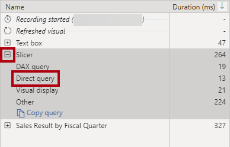

---
lab:
  title: Aprimorar o desempenho da consulta com o modo de armazenamento duplo
  module: Optimize enterprise-scale tabular models
---

# Aprimorar o desempenho da consulta com o modo de armazenamento duplo

## Visão geral

**O tempo estimado para concluir o laboratório é de 30 minutos**

Neste laboratório, você melhorará o desempenho de um modelo composto definindo algumas tabelas para usar o modo de armazenamento duplo.

Neste laboratório, você aprenderá a:

- Configurar modo de armazenamento duplo.

- Usar o Performance Analyzer para revisar as atividades de atualização.

## Introdução

Neste exercício, você preparará seu ambiente.

### Clonar o repositório para este curso

1. No menu Iniciar, abra o Prompt de Comando

    

1. Na janela do prompt de comando, navegue até a unidade D digitando:

    `d:` 

   Pressione ENTER.

    

1. Na janela do prompt de comando, digite o seguinte comando para baixar os arquivos do curso e salve-os em uma pasta chamada DP500.
    
    `git clone https://github.com/MicrosoftLearning/DP-500-Azure-Data-Analyst DP500`
   
1. Quando o repositório tiver sido clonado, feche a janela do prompt de comando. 
   
1. Abra a unidade D no explorador de arquivos para garantir que os arquivos tenham sido baixados.

### Configurar o Power BI Desktop

Nesta tarefa, você abrirá uma solução pré-desenvolvida do Power BI Desktop.

1. Para abrir o Explorador de Arquivos, na barra de tarefas, selecione o atalho do **Explorador de Arquivos**.

2. Procure a pasta **D:\DP500\Allfiles\11\Starter**.

3. Para abrir um arquivo pré-desenvolvido do Power BI Desktop, clique duas vezes no arquivo **Sales Analysis - Improve query performance with dual storage mode.pbix**.

4. Se for avisado sobre um possível risco de segurança, leia a mensagem e selecione **OK.**

5. Se você for solicitado a aprovar a execução de uma consulta de banco de dados nativa, selecione **Executar**.

6. Para salvar o arquivo, na guia **Arquivo** da faixa de opções, selecione **Salvar Como**.

7. Na janela **Salvar como**, procure a pasta **D:\DP500\Allfiles\11\MySolution**.

8. Selecione **Salvar**.

### Revisar o relatório

Nesta tarefa, você examinará o relatório pré-desenvolvido.

1. No Power BI Desktop, no canto inferior direito da barra de status, observe que o modo de armazenamento é Misto.

    

    *Um modelo de misto compreende tabelas de diferentes grupos de origem. Esse modelo tem uma tabela de importação que obtém dados de uma pasta de trabalho do Excel. As tabelas restantes usam uma conexão DirectQuery com um banco de dados SQL Server, que é o data warehouse.*

2. Revise o design do relatório.

    

    *Esta página de relatório tem um título e dois visuais. O visual da segmentação de dados permite a filtragem por um único ano fiscal, enquanto que o visual do gráfico de colunas exibe vendas trimestrais e valores desejados. Você melhorará o desempenho do relatório definindo algumas tabelas para usar o modo de armazenamento duplo.*

### Examinar o modelo de dados

Nesta tarefa, você examinará o modelo de dados pré-desenvolvido.

1. Alterne para a exibição de **Modelo**.

    

2. Use o diagrama de modelo para examinar o design do modelo.

    

    *O modelo é composto por três tabelas dimensionais e duas tabelas de fatos. A tabela de fatos **Vendas** representa os detalhes da ordem do cliente, enquanto a tabela **Metas** representa as metas de vendas trimestrais. É um design clássico de esquema de estrelas. A barra na parte superior de algumas das tabelas indica que elas usam o modo de armazenamento DirectQuery. Cada tabela que tem uma barra azul pertence ao mesmo grupo de origem.*

    *Neste laboratório, você configurará algumas tabelas para usar o modo de armazenamento duplo.*

## Configurar modo de armazenamento duplo

Neste exercício, você configurará o modo de armazenamento duplo.

*Uma tabela de modelo que usa o modo de armazenamento duplo usa o modo de armazenamento de importação e DirectQuery ao mesmo tempo. O Power BI determina o modo de armazenamento mais eficiente a ser usado em uma consulta por consulta, esforçando-se para usar o modo de importação sempre que possível porque é mais rápido.*

### Usar o Performance Analyzer

Nesta tarefa, você abrirá o Performance Analyzer e o usará para inspecionar eventos de atualização.

1. Alterne para a exibição de **Relatório**.

    

2. Para inspecionar eventos de atualização visual, na guia**Exibir** da faixa de opções, dentro do grupo de painéis **Mostrar**, selecione **Performance Analyzer**.

    

3. No painel **Performance Analyzer** (localizado à esquerda do painel **Visualizações**), selecione **Iniciar gravação**.

    

    *O Performance Analyzer inspeciona e exibe a duração necessária para atualizar os visuais. Cada visual emite pelo menos uma consulta ao banco de dados de origem. Para obter mais informações, veja [Usar o Performance Analyzer para examinar o desempenho do elemento de relatório](https://docs.microsoft.com/power-bi/create-reports/desktop-performance-analyzer).*

4. Selecione **Atualizar visuais**.

    

5. No painel **Performance Analyzer**, expanda para abrir o visual **Segmentação** e observe o evento de consulta direta.

    

    *Sempre que você vir um evento de consulta direta, ele informará que o Power BI usou o modo de armazenamento DirectQuery para recuperar os dados do banco de dados de origem.*

6. Expanda o visual **Resultado de vendas por trimestre fiscal** e observe que ele também registrou um evento de consulta direta.

    

    *Você sempre configura um visual de segmentação de dados usando um ou mais campos da mesma tabela. Não é possível usar campos de tabelas diferentes para configurar uma segmentação de dados. Além disso, uma segmentação de dados quase sempre usa campos de uma tabela de dimensão. Portanto, para melhorar o desempenho de consulta de elementos visuais de segmentação de dados, certifique-se de que eles armazenem dados importados. Nesse caso, como as tabelas de dimensão usam o modo de armazenamento DirectQuery, você pode defini-las para o modo de armazenamento duplo. Como as tabelas de dimensão armazenam poucas linhas (em relação às tabelas de fatos), isso não deve resultar em um cache de modelo excessivamente grande.*

### Configurar modo de armazenamento duplo

Neste tarefa, você configurará todas as tabelas de dimensão para usar o modo de armazenamento duplo.

1. Alterne para a exibição de **Modelo**.

2. Selecione o cabeçalho da tabela **Produto**.

3. Ao pressionar a tecla **Ctrl**, selecione também os cabeçalhos das tabelas **Data do Pedido** e **Território de Vendas**.

4. No painel **Propriedades**, expanda para abrir a seção **Avançado**.

    

5. **Na lista suspensa Modo de armazenamento**, selecione **Duplo**.

    

6. Quando a solicitação para confirmar a atualização for exibida, selecione **OK**.

    

    *O aviso informa que pode levar um tempo considerável para o Power BI Desktop importar dados para as tabelas de modelo.*

7. No diagrama de modelo, observe a barra listrada na parte superior de cada tabela de dimensão.

    

    *Uma barra listrada indica o modo de armazenamento duplo.*

### Revisar o relatório

Nesta tarefa, você examinará o relatório pré-desenvolvido.

1. Alterne para a exibição de **Relatório**.

    

2. No painel do **Performance analyzer**, clique em **Limpar**.

    

3. Atualizar os visuais.

    

4. Observe que o visual da segmentação de dados não usa mais uma conexão de consulta direta.

    *O Power BI consulta o cache de modelo de dados importados, portanto, a segmentação de dados agora é atualizada mais rapidamente.*

5. Observe, no entanto, que o visual do gráfico de colunas ainda usa uma conexão de consulta direta.

    *Isso porque o campo **Valor de Vendas** é uma coluna da tabela **Vendas**, que usa o modo de repositório DirectQuery.*

6. Selecione os visuais do gráfico de colunas e, no painel **Visualizações**, de dentro da caixa **Valores**, remova o campo **Valor das Vendas**.

    

7. Remova também bem os dois campos da caixa **Dicas de Ferramentas**.

    

    *Ambas as medidas dependem da coluna **Valor de Vendas**.*

8. No painel **Performance Analyzer** pane, expanda e abra o último evento de atualização e observe que o visual do gráfico de colunas não usa mais uma conexão de consulta direta.

    *Isso ocorre porque o visual do gráfico de colunas agora usa apenas duas tabelas, ambas armazenadas em cache no modelo. A tabela **Order Date** usa o modo de armazenamento duplo, enquanto a tabela **Targets** usa o modo de armazenamento de importação.*

    *Agora você melhorou o desempenho de consultas específicas em que o Power BI pode recuperar dados do cache do modelo. A principal conclusão é que as tabelas de dimensão relacionadas a tabelas de fatos do DirectQuery geralmente devem ser definidas para o modo de armazenamento duplo. Dessa forma, quando consultadas por uma segmentação de dados, as consultas serão rápidas.*

    *Você pode otimizar ainda mais o modelo para melhorar o desempenho da consulta adicionando agregações. No entanto, esse aprimoramento será o objetivo de aprendizagem de um laboratório diferente.*

### Conclusão

Nesta tarefa, você vai concluir.

1. Salve o arquivo do Power BI Desktop.

    

2. Feche o Power BI Desktop.
