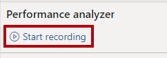
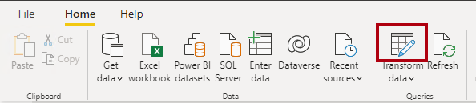
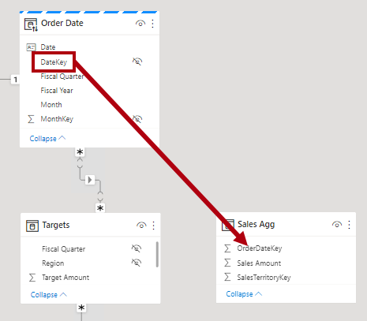
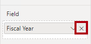

---
lab:
  title: Aprimorar o desempenho de consulta usando agregações
  module: Optimize enterprise-scale tabular models
---

# Aprimorar o desempenho de consulta usando agregações

## Visão geral

**O tempo estimado para concluir o laboratório é de 30 minutos**

Neste laboratório, você adicionará uma agregação para melhorar o desempenho de consulta da tabela de fatos **Vendas**.

Neste laboratório, você aprenderá a:

- Configurar uma agregação.

- Usar o Performance Analyzer para determinar se o Power BI usa uma agregação.

## Introdução

Neste exercício, você preparará seu ambiente.

### Clonar o repositório para este curso

1. No menu Iniciar, abra o Prompt de Comando

    

1. Na janela do prompt de comando, navegue até a unidade D digitando:

    `d:` 

   Pressione ENTER.

    

1. Na janela do prompt de comando, digite o seguinte comando para baixar os arquivos do curso e salve-os em uma pasta chamada DP500.
    
    `git clone https://github.com/MicrosoftLearning/DP-500-Azure-Data-Analyst DP500`
   
1. Quando o repositório tiver sido clonado, feche a janela do prompt de comando. 
   
1. Abra a unidade D no explorador de arquivos para garantir que os arquivos tenham sido baixados.

### Configurar o Power BI Desktop

Nesta tarefa, você abrirá uma solução pré-desenvolvida do Power BI Desktop.

1. Para abrir o Explorador de Arquivos, na barra de tarefas, selecione o atalho do **Explorador de Arquivos**.

2. Procure a pasta **D:\DP500\Allfiles\12\Starter**.

3. Para abrir um arquivo pré-desenvolvido do Power BI Desktop, clique duas vezes no arquivo **Sales Analysis - Improve query performance with aggregations.pbix**.

    *Se você receber um aviso de risco potencial de segurança, **selecione OK***.
    
    *Se você for solicitado a aprovar a execução de uma consulta de banco de dados nativa, **selecione Executar**.

4. Para salvar o arquivo, na guia **Arquivo** da faixa de opções, selecione **Salvar como**.

5. Na janela **Salvar como**, procure a pasta **D:\DP500\Allfiles\12\MySolution**

6. Selecione **Salvar**.

### Revisar o relatório

Nesta tarefa, você examinará o relatório pré-desenvolvido.

1. No Power BI Desktop, no canto inferior direito da barra de status, observe que o modo de armazenamento é **Misto**.

    

    *Um modelo de modo misto compreende tabelas de diferentes grupos de origem. Esse modelo tem uma tabela de importação que obtém dados de uma pasta de trabalho do Excel. As tabelas restantes usam uma conexão DirectQuery com um banco de dados SQL Server, que é o data warehouse.*

2. Revise o design do relatório.

    

    *Esta página de relatório tem um título e dois visuais. O visual da segmentação de dados permite a filtragem por um único ano fiscal, enquanto que o visual do gráfico de colunas exibe vendas trimestrais e valores desejados. Neste laboratório, você melhorará o desempenho do relatório adicionando uma agregação.*

### Examinar o modelo de dados

Nesta tarefa, você examinará o modelo de dados pré-desenvolvido.

1. Alterne para a exibição de **Modelo**.

    

2. Use o diagrama de modelo para examinar o design do modelo.

    

    *O modelo é composto por três tabelas dimensionais e duas tabelas de fatos. A tabela de fatos **Vendas** representa os detalhes da ordem do cliente, enquanto a tabela **Metas** representa as metas de vendas trimestrais. É um design clássico de esquema de estrelas. A barra na parte superior de algumas das tabelas indica que elas usam o modo de armazenamento DirectQuery. Cada tabela que tem uma barra azul pertence ao mesmo grupo de origem.*

    *As tabelas de três dimensões têm uma barra listrada, o que indica que elas usam o modo de armazenamento duplo. Isso significa que as tabelas usam o modo de armazenamento de importação e DirectQuery. O Power BI determina o modo de armazenamento mais eficiente a ser usado em uma consulta por consulta, esforçando-se para usar o modo de importação sempre que possível porque é mais rápido.*

    *Neste laboratório, você adicionará uma agregação para melhorar o desempenho de consultas de tabela de **Vendas** específicas.*

### Usar o Performance Analyzer

Nesta tarefa, você abrirá o Performance Analyzer e o usará para inspecionar eventos de atualização.

1. Alterne para a exibição de **Relatório**.

    

2. Para inspecionar eventos de atualização visual, na guia**Exibir** da faixa de opções, dentro do grupo de painéis **Mostrar**, selecione **Performance Analyzer**.

    

3. No painel **Performance Analyzer** (localizado à esquerda do painel **Visualizações**), selecione **Iniciar gravação**.

    

    *O Performance Analyzer inspeciona e exibe a duração necessária para atualizar os visuais. Cada visual emite pelo menos uma consulta ao banco de dados de origem. Para obter mais informações, veja [Usar o Performance Analyzer para examinar o desempenho do elemento de relatório](https://docs.microsoft.com/power-bi/create-reports/desktop-performance-analyzer).*

4. Selecione **Atualizar visuais**.

    

5. No painel **Performance Analyzer**, expanda para abrir o visual **Resultado de vendas por trimestre fiscal** e observe o evento de consulta direta.

6. Anote a duração total em milissegundos para que você possa usá-la como linha de base para comparação mais adiante neste laboratório.

    

    *Sempre que você vir um evento de consulta direta, ele informará que o Power BI usou o modo de armazenamento DirectQuery para recuperar os dados do banco de dados de origem.*

    *Uma razão comum pela qual uma tabela de fatos de data warehouse usa o modo DirectQuery é devido a seu grande volume de dados. Não é possível, nem economicamente prático, importar um volume tão grande de dados. No entanto, o modelo de dados pode armazenar em cache uma exibição agregada da tabela de fatos que pode ajudar a melhorar o desempenho de consultas específicas, geralmente de alto nível.*

    *Neste laboratório, você adicionará uma agregação dos dados da tabela **Vendas** para melhorar especificamente o desempenho de atualizações de visuais que consultam a soma da coluna **Valor das Vendas** por data e região de vendas.*

## Configurar uma agregação

Neste exercício, você configurará uma agregação.

*As agregações no Power BI podem melhorar o desempenho da consulta em tabelas DirectQuery excepcionalmente grandes. Usando agregações, o modelo de dados armazena em cache os dados em um nível agregado na memória. O Power BI usa a agregação automaticamente sempre que pode.*

### Adicionar uma tabela de agregação

Nesta tarefa, você adicionará uma tabela de agregação ao modelo.

1. Para abrir a janela do Editor do Power Query, na guia **Página Inicial** da faixa de opções, dentro do grupo **Consultas**, selecione o ícone **Transformar dados**.

    

2. Na janela do Editor do Power Query, dentro do painel **Consultas**, clique com o botão direito do mouse na consulta **Vendas** e selecione **Duplicar**.

    

3. No painel **Consultas**, observe a adição de uma nova consulta.

    

    *Você aplicará uma transformação para agrupar pelas colunas **OrderDateKey** e **SalesTerritoryKey** e agregará a soma da coluna **Valor das Vendas**.*

4. No painel **Configurações de Consulta** (localizado à direita), na caixa **Nome**, substitua o texto por **Sales Agg**.

    

5. Na guia **Transformar** da faixa de opções, dentro do grupo **Tabela**, selecione **Agrupar por**.

    

6. Na janela **Agrupar por**, selecione a opção **Avançado**.

    

    *A opção avançada permite agrupar por mais de uma coluna.*

7. Na lista suspensa de agrupamento, selecione **OrderDateKey**.

    

8. Clique em **Adicionar agrupamento**.

    

9. Na segunda lista suspensa de agrupamento, selecione **SalesTerritoryKey**.

    

10. Na caixa **Nome da nova coluna**, substitua o texto por **Valor das Vendas**.

11. Na lista suspensa **Operação**, selecione **Soma**.

12. Na lista suspensa **Coluna** , selecione **Valor das Vendas**.

    

13. Selecione **OK**.

    

14. Na guia **Página Inicial** da faixa de opções, dentro do grupo **Fechar**, clique no ícone **Fechar &amp; Aplicar**.

    

    *O Power BI Desktop adiciona uma nova tabela ao modelo.*

15. Salve o arquivo do Power BI Desktop.

    

### Definir propriedades do modelo

Nesta tarefa, você definirá as propriedades do modelo para a nova tabela.

1. Alterne para a exibição de **Modelo**.

    

2. No diagrama de modelo, posicione a nova tabela de modo que ela fique à direita da tabela **Destinos** .

    

3. Observe que a tabela **Sales Agg** tem uma barra azul na parte superior, indicando que está usando o modo de armazenamento DirectQuery.

    *Embora seja possível que as agregações usem o modo de armazenamento DirectQuery, nesses casos elas devem se conectar a uma exibição materializada na fonte de dados. Neste laboratório, a agregação usará o modo de armazenamento de importação.*

4. Selecione a guia **Sales Agg**.

5. No painel **Propriedades**, expanda para abrir a seção **Avançado**.

    

6. Na lista suspensa **Modo de armazenamento**, selecione **Importar**.

    

7. Quando a solicitação para confirmar a atualização for exibida, selecione **OK**.

    

    *O aviso informa que pode levar um tempo considerável para o Power BI Desktop importar dados para as tabelas de modelo. Também informa que é uma ação irreversível. Não é possível alterar uma tabela de modo de armazenamento de importação de volta para uma tabela de modo de armazenamento DirectQuery (a menos que você restaure uma versão anterior do arquivo do Power BI Desktop).*

8. Observe que o Power BI Desktop carregou 6.806 linhas de dados na nova tabela.

    

    *Essas linhas representam cada combinação de data da ordem e região de vendas. É uma quantidade muito pequena de dados que resume um volume potencialmente muito grande de linhas da tabela de fatos.*

9. Na tabela **Sales Agg**, selecione a coluna **Valor das Vendas**.

10. No painel **Propriedades**, na seção **Formatação**, na lista suspensa **Tipo de dados**, selecione **Número decimal fixo**.

    

    *Para gerenciar a agregação (mais adiante neste exercício), o tipo de dados deve corresponder ao da coluna **Valor das Vendas** na tabela **Vendas**.*

11. Quando a solicitação para confirmar a atualização for exibida, selecione **OK**.

    

### Criar relações de modelo

Nesta tarefa, você criará relações de modelo.

1. Para criar uma relação, na tabela **Datada ordem**, arraste a coluna **DateKey** e solte-a na coluna **OrderDateKey** da tabela **Sales Agg**.

    

2. Na janela **Criar relacionamento**, observe que a lista suspensa **Cardinalidade** está definida como **Um para muitos**.

    *A coluna **DateKey** na tabela **Data da Ordem** contém valores exclusivos, enquanto que a coluna **OrderDateKey** na tabela **Sales Agg** contém valores duplicados. Essa cardinalidade um-para-muitos é comum para relacionamentos entre dimensões e agregações baseadas em tabelas de fatos.*

3. Selecione **OK**.

    

4. No diagrama do modelo, observe que agora existe um relacionamento entre as tabelas **Data da Ordem** e **Sales Agg**.

5. Crie outro relacionamento, desta vez relacionando a coluna **SalesTerritoryKey** da tabela **Região de Vendas** à coluna **SalesTerritoryKey** da tabela **Sales Agg**.

    

6. Na janela **Criar relacionamento**, selecione **OK**.

    

    *As tarefas concluídas neste laboratório adicionaram uma tabela de importação ao modelo e a relacionaram a outras tabelas de modelo. No entanto, esta ainda não é uma agregação que o Power BI pode usar de forma transparente para melhorar o desempenho da consulta. Você configurará a agregação na próxima tarefa.*

7. Revise o diagrama do modelo e observe que a tabela **Sales Agg** agora está relacionada a duas tabelas de dimensão.

    

### Configurar uma agregação

Nesta tarefa, você configurará uma agregação.

1. No diagrama do modelo, clique com o botão direito do mouse no cabeçalho da tabela **Sales Agg** e selecione **Gerenciar agregações**.

    

2. Na janela **Gerenciar agregações**, para a coluna **OrderDateKey**, defina as seguintes propriedades:

    - Resumo: **GroupBy**

    - Tabela detalhada: **Vendas**

    - Coluna de detalhes: **OrderDateKey**

    

3. Para a coluna **Valor das Vendas**, defina as seguintes propriedades:

    - Resumo: **Soma**

    - Tabela detalhada: **Vendas**

    - Coluna de detalhes: **Valor das Vendas**

4. Para a coluna **SalesTerritoryKey**, defina as seguintes propriedades:

    - Resumo: **GroupBy**

    - Tabela detalhada: **Vendas**

    - Coluna de detalhes: **SalesTerritoryKey**

5. Verifique se a configuração da agregação ficou semelhante ao seguinte:

    

6. Observe o aviso que descreve que o Power BI ocultará a tabela.

    

    *O Power BI Desktop ocultará a tabela de uma maneira diferente de outros objetos de modelo ocultos. O Power BI sempre ocultará agregações e nem mesmo os cálculos de modelo poderão fazer referência a elas.*

7. Selecione **Aplicar a todas**.

    

8. No diagrama do modelo, observe que a tabela **Sales Agg** é uma tabela oculta.

    

    *Agora, sempre que um visual consultar a tabela **Vendas** para obter a soma da coluna **Valor das Vendas**, agrupada por qualquer coluna da tabela **Data da Ordem** ou **Região de Vendas**, o Power BI usará a agregação.*

### Testar a agregação

Nesta tarefa, você testará a agregação e determinará se ela deve ser usada pelo Power BI.

1. Alterne para a exibição de **Relatório**.

    

2. No painel **Performance Analyzer**, selecione **Atualizar visuais**.

    

3. Expanda para abrir o visual **Resultado de vendas por trimestre fiscal** e observe que ele não tem mais um evento de consulta direta.

4. Compare a duração com a linha de base que você observou anteriormente neste laboratório.

    

    *O que acontece quando os usuários filtram o visual do gráfico de colunas por outras tabelas?*

5. Para clonar a segmentação de **Ano Fiscal**, primeiro selecione a segmentação.

6. Na guia **Página Inicial** da faixa de opções, dentro do grupo **Área de transferência**, selecione **Copiar**.

    

7. Na guia **Página Inicial** da faixa de opções, dentro do grupo **Área de transferência**, selecione **Colar**.

    

8. Posicione a nova segmentação diretamente abaixo da segmentação original.

    

9. Selecione a nova segmentação e, no painel **Visualizações**, na caixa **Campo**, remova o campo **Ano Fiscal**.

    

10. No painel **Campos**, expanda para abrir a tabela **Região de Vendas** e arraste o campo **Grupo** para a caixa **Campo**.

    

11. Na segmentação de **Grupo**, selecione qualquer grupo (exceto em branco).

    

    *O Power BI usa a agregação?*

    *A resposta é sim porque a agregação agrupa pela coluna **SalesTerritoryKey**. Essa coluna está relacionada à tabela **Região de Vendas**. Portanto, você pode usar qualquer coluna da tabela **Região de Vendas** para filtrar o visual do gráfico de colunas e ele usará a agregação.*

12. Clone a segmentação de **Grupo** para criar uma segmentação com base no campo **Categoria** da tabela **Produto**.

    

    *O Power BI usa a agregação?*

    *A resposta é não porque a agregação não agrupa pela coluna **ProductKey** (ou qualquer outra coluna da tabela **Produto**). Nesse caso, o Power BI deve usar uma conexão DirectQuery para atualizar o visual.*

    *Agora você melhorou o desempenho de consultas específicas, permitindo que o Power BI recupere dados do cache do modelo. A principal conclusão é que as agregações podem acelerar o desempenho de consultas de tabela de fatos, especialmente para medidas específicas e agrupamentos de alto nível. Além disso, o modo de armazenamento duplo e as agregações funcionam bem juntos, permitindo que o Power BI evite o uso de conexões dispendiosas do DirectQuery com dados de origem.*

### Conclusão

Nesta tarefa, você vai concluir.

1. Salve o arquivo do Power BI Desktop.

    

2. Feche o Power BI Desktop.
