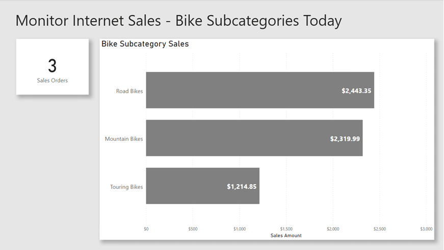
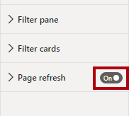

---
lab:
  title: Monitorar dados em tempo real
  module: Implement advanced data visualization techniques by using Power BI
---

# Monitorar dados em tempo real

## Visão geral

**O tempo estimado para concluir o laboratório é de 30 minutos**

Neste laboratório, você configurará um relatório para usar a atualização automática de página. Dessa forma, será possível que os consumidores do relatório acompanhem os resultados de vendas pela internet em tempo real.

Neste laboratório, você aprenderá a:

- Usar o Performance Analyzer para revisar as atividades de atualização.

- Configurar a atualização automática de página.

- Criar e usar o recurso de detecção de alterações.

## Introdução

Neste exercício, você preparará seu ambiente.

### Clonar o repositório para este curso

1. No menu Iniciar, abra o Prompt de Comando

    

1. Na janela do prompt de comando, navegue até a unidade D digitando:

    `d:` 

   Pressione ENTER.

    

1. Na janela do prompt de comando, digite o seguinte comando para baixar os arquivos do curso e salve-os em uma pasta chamada DP500.
    
    `git clone https://github.com/MicrosoftLearning/DP-500-Azure-Data-Analyst DP500`
   
1. Quando o repositório tiver sido clonado, feche a janela do prompt de comando. 
   
1. Abra a unidade D no explorador de arquivos para garantir que os arquivos tenham sido baixados.

### Configurar o banco de dados

Nesta tarefa, você usará o SQL Server Management Studio (SSMS) para configurar o banco de dados executando dois scripts.

1. Para abrir o SSMS, na barra de tarefas, clique no atalho do **SSMS**.

    

2. Na janela **Conectar ao Servidor**, verifique se a lista suspensa **Nome do servidor** está definida como **localhost** e se a lista suspensa Autenticação está definida como **Autenticação do Windows**.
    

3. Selecione **Conectar**.

4. Para abrir um arquivo de script, no menu **Arquivo**, selecione **Abrir** > **Arquivo**.

5. Na janela **Abrir arquivo**, procure a pasta **D:\DP500\Allfiles\14\Assets**.

6. Selecione o arquivo **1-Setup.sql**.

    

7. Selecione **Abrir**.

    

8. Revise o script.

    *Esse script cria uma tabela chamada **FactInternetSalesRealTime**. Um script diferente carregará dados nessa tabela para simular uma carga de trabalho em tempo real de ordens de venda pela Internet.*

9. Para executar um script, na barra de ferramentas, selecione **Executar** (ou pressione **F5**).

    

10. Para fechar o arquivo, no menu **Arquivo**, clique em **Fechar**.

11. Abra o arquivo **2-InsertOrders.sql**.

    

12. Revise esse script também.

    *Esse script executa um loop infinito. Para cada loop, ele insere uma ordem de venda e, em seguida, atrasa por um período aleatório de 1 a 15 segundos.*

13. Execute o script e deixe-o em execução até o final do laboratório.

### Configurar o Power BI Desktop

Nesta tarefa, você abrirá uma solução pré-desenvolvida do Power BI Desktop.

1. Para abrir o Explorador de Arquivos, na barra de tarefas, selecione o atalho do **Explorador de Arquivos**.

2. Procure a pasta **D:\DP500\Allfiles\14\Starter**.

3. Para abrir um arquivo pré-desenvolvido do Power BI Desktop, clique duas vezes no arquivo **Internet Sales - Monitor data in real time.pbix**.

4. Para salvar o arquivo, na guia **Arquivo** da faixa de opções, selecione **Salvar como**.

5. Na janela **Salvar como**, procure a pasta **D:\DP500\Allfiles\14\MySolution**.

6. Selecione **Salvar**.

### Revisar o relatório

Nesta tarefa, você examinará o relatório pré-desenvolvido.

1. No Power BI Desktop, revise a página do relatório.

    

    *A página do relatório tem um título e dois visuais. O visual do cartão exibe o número de ordens de venda, enquanto que o visual do gráfico de barras exibe o valor das vendas para cada subcategoria de bicicleta.*

2. Para atualizar o relatório, na guia **Exibir** da faixa de opções, dentro do grupo de painéis **Mostrar**, selecione **Performance Analyzer** .

    

3. No painel **Performance Analyzer** (localizado à direita do painel **Visualizações**), selecione **Iniciar gravação**.

    

    *O Performance Analyzer inspeciona e exibe a duração necessária para atualizar os visuais. Cada visual emite pelo menos uma consulta ao banco de dados de origem. Para obter mais informações, veja [Usar o Performance Analyzer para examinar o desempenho do elemento de relatório](https://docs.microsoft.com/power-bi/create-reports/desktop-performance-analyzer).*

4. Selecione **Atualizar visuais**.

    

5. Observe que os visuais do relatório são atualizados para mostrar os resultados mais recentes das vendas pela Internet.

    *Ao desenvolver um relatório que se conecta a um modelo DirectQuery local, não é possível atualizar o relatório usando o comando **Atualizar** (localizado na guia **Página Inicial** da faixa de opções). Isso ocorre porque o Power BI Desktop atualiza as conexões de tabela DirectQuery. Para atualizar os visuais do relatório, siga as etapas que você acabou de realizar. Quando publicado no serviço do Power BI, os consumidores do relatório poderão selecionar **Atualizar** na barra de ações para atualizar os visuais do relatório.*

    *Quando você cria um relatório para análise em tempo real, deve haver uma maneira melhor do que pedir aos usuários que atualizem constantemente a página do relatório. Você conseguirá isso ao configurar a atualização automática de página no próximo exercício.*

## Configurar a atualização automática de página

Neste exercício, você configurará a atualização automática de página e experimentará usando o recurso de detecção de alterações.

*A atualização automática de página requer pelo menos uma tabela de modelo definida para usar o modo de armazenamento DirectQuery.*

### Configurar a atualização automática de página

Nesta tarefa, você configurará a atualização automática da página.

1. Para selecionar a página de relatório, primeiro clique em uma área vazia da página de relatório.

2. No painel **Visualizações**, selecione o ícone de formatação (pincel).

    

3. Alterne a configuração **Atualização de página** (última da lista) para **Ativado**.

    

    *A atualização automática de página é uma configuração em nível de página. Você pode habilitá-la para páginas específicas no relatório.*

4. No painel **Performance Analyzer**, observe que os visuais do relatório acabaram de ser atualizados.

5. No painel **Visualizações**, expanda para abrir as configurações de **Atualização de página**.

    

6. Observe que, por padrão, a página será atualizada a cada 30 minutos.

7. Modifique as configurações para atualizar a página a cada 5 segundos.

    

    *Importante: este intervalo de atualização frequente irá ajudá-lo a trabalhar de forma eficiente neste laboratório. No entanto, tome cuidado, pois a definição de um intervalo de atualização mais frequente pode afetar seriamente o desempenho do banco de dados de origem e de outros usuários que visualizam o relatório.*

    *Como uma ordem de venda pela Internet é carregada a cada 1 a 15 segundos, às vezes a atualização da página recupera os mesmos resultados (porque o banco de dados não registrou nenhum pedido nos últimos cinco segundos). De preferência, os visuais do relatório só são atualizados quando necessário. Você configurará o recurso de detecção de alterações para fazer isso na próxima tarefa.*

    *Depois de publicar no serviço do Power BI, os intervalos de atualização inferiores a 30 minutos exigem que você salve o relatório em um workspace atribuído à capacidade Premium. Além disso, um administrador de capacidade deve habilitar e configurar a capacidade para permitir esses intervalos frequentes. Para obter mais informações, veja [Atualização automática de página no Power BI.](https://docs.microsoft.com/power-bi/create-reports/desktop-automatic-page-refresh)*

### Configurar a detecção de alterações

Nesta tarefa, você configurará a detecção de alterações.

1. Nas configurações de **Atualização de página**, defina a lista suspensa **Tipo de atualização** como **Detecção de alterações**.

    

2. Para criar uma medida de detecção de alterações, selecione o link **Adicionar detecção de alterações**.

    

3. Na janela **Detecção de alterações**, observe que a configuração padrão é criar uma nova medida.

    

4. Na lista suspensa **Escolher um cálculo**, selecione **Contar (Distinta).**

    

5. No painel **Campos** (localizado à direita, dentro da janela), role para baixo para localizar a tabela **Vendas pela Internet**.

6. Selecione o campo **Ordem de venda** e observe que a janela o adicionou à caixa **Escolher um campo ao qual aplicá-lo**.

    

7. Para a configuração **Verificar se há alterações a cada**, defina como 5 segundos.

    

8. Selecione **Aplicar**.

    

9. No painel **Campos**, dentro da tabela **Vendas pela Internet**, observe a adição de uma medida de detecção de alterações.

    

    *O Power BI agora usa a medida de detecção de alterações para consultar o banco de dados de origem a cada cinco segundos. A cada vez, o Power BI armazena o resultado para que possa compará-lo na próxima vez que for usado. Quando os resultados diferem, isso significa que os dados foram alterados (nesse caso, o banco de dados inseriu novas ordens de venda pela internet). Assim, o Power BI atualiza todos os visuais da página do relatório.*

    *Depois de publicado no serviço do Power BI, o Power BI somente dá suporte a medidas de detecção de alterações para capacidades Premium.*

10. No painel do **Performance Analyzer**, clique em **Limpar**.

    

11. Observe que o Performance Analyzer exibe consultas de detecção de alterações.

12. Observe que, às vezes, várias consultas de detecção de alterações ocorrem antes que o Power BI Desktop atualize os visuais do relatório.

    *Isso ocorre porque o banco de dados não inseriu novas ordens de venda pela internet naquele momento. Essa configuração agora é mais eficiente porque os visuais de relatório só são atualizados quando necessário.*

### Conclusão

Nesta tarefa, você vai concluir.

1. Salve o arquivo do Power BI Desktop.

    

2. Feche o Power BI Desktop.

3. No SSMS, para interromper a execução do script, na barra de ferramentas, clique em **Parar** (ou pressione **Alt+Break**).

    

4. Feche o arquivo de script.

5. Abra o arquivo **3-Cleanup.sql**.

    

    *Esse script remove a tabela **FactInternetSalesRealTime** .*

6. Execute o script.

7. Feche o SSMS.
