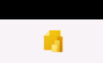
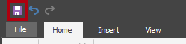
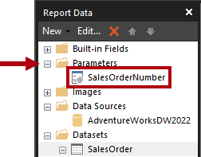
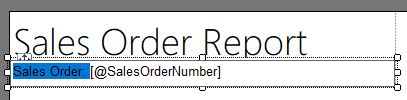
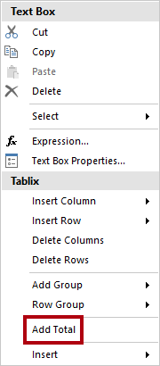
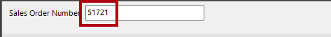
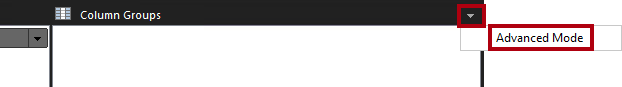
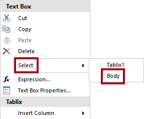

# Criar um relatório paginado

## Visão geral

**O tempo estimado para concluir o laboratório é de 45 minutos**

Neste laboratório, você usará o Power BI Report Builder para desenvolver um layout de relatório paginado visualmente perfeito que obtém os dados do banco de dados **AdventureWorksDW2022-DP500** do SQL Server. Você criará uma fonte e um conjunto de dados e também configurará um parâmetro de relatório. O layout do relatório permitirá que os dados sejam renderizados em várias páginas e sejam exportados em PDF e em outros formatos.

O relatório final terá a seguinte aparência:


Neste laboratório, você aprenderá a:

- Usar o Power BI Report Builder

- Criar um layout de relatório de várias páginas

- Definir uma fonte de dados

- Definir um conjunto de dados

- Criar um parâmetro de relatório

- Exportar um relatório para PDF

## Introdução

Neste exercício, você abrirá o Power BI Report Builder para criar e salvar um relatório.

### Clonar o repositório para este curso

1. No menu Iniciar, abra o Prompt de Comando

    

1. Na janela do prompt de comando, navegue até a unidade D digitando:

    `d:` 

   Pressione ENTER.

    


1. Na janela do prompt de comando, digite o seguinte comando para baixar os arquivos do curso e salve-os em uma pasta chamada DP500.
    
    `git clone https://github.com/MicrosoftLearning/DP-500-Azure-Data-Analyst DP500`
   
1. Quando o repositório tiver sido clonado, feche a janela do prompt de comando. 
   
1. Abra a unidade D no explorador de arquivos para garantir que os arquivos tenham sido baixados.

### Criar o relatório

Nesta tarefa, você abrirá o Power BI Report Builder para criar e salvar um relatório.

1. Para abrir o Power BI Report Builder, na barra de tarefas, selecione o atalho **Power BI Report Builder**.

    

1. Se você for solicitado a atualizar para a versão mais recente do Power BI Report Builder, selecione **Cancelar**.

2. No Power BI Report Builder, na janela **Introdução**, clique em **Relatório em Branco** para criar um relatório.

    

  
3. Para salvar o relatório, selecione a guia **Arquivo** (localizada na parte superior esquerda) e clique em **Salvar**.

    

4. Na janela **Salvar como Relatório**, procure a pasta **D:\DP500\Allfiles\15\MySolution**.

5. Na caixa **Nome**, digite**Relatório de ordem de venda**.

6. Selecione **Salvar**.

## Elaborar o layout do relatório

Neste exercício, você desenvolverá o layout do relatório e explorará o design do relatório final.

### Configurar o cabeçalho do relatório

Nesta tarefa, você configurará o cabeçalho do relatório.

1. No designer de relatórios, observe o layout de relatório padrão, que consiste em uma região de corpo e uma região de rodapé do relatório.

    

    *O corpo contém uma caixa de texto pronta para um título de relatório e o rodapé do relatório contém uma caixa de texto que descreve o tempo de execução do relatório.*

    *O design padrão renderizará o título do relatório uma vez, no corpo, na primeira página renderizada. No entanto, agora você modificará o design do relatório adicionando uma região de cabeçalho do relatório e movendo a caixa de texto do título do relatório para ela. Dessa forma, o título do relatório se repetirá em todas as páginas. Você também adicionará uma imagem do logotipo da empresa.*

2. Para adicionar uma região de cabeçalho do relatório, na guia **Inserir** da faixa de opções, dentro do grupo **Cabeçalho &amp; Rodapé**, abra **Cabeçalho** e selecione **Adicionar Cabeçalho**.

    

3. No designer de relatórios, observe que uma região de cabeçalho do relatório foi adicionada ao layout do relatório.

4. Para selecionar a caixa de texto do corpo, clique na caixa de texto "Clique para adicionar título".

5. Para mover a caixa de texto, selecione o ícone de seta de quatro pontas, arraste-a para a região do cabeçalho e solte-a na parte superior esquerda da região de cabeçalho do relatório.

    

6. Para modificar o texto da caixa de texto do título do relatório, clique dentro da caixa de texto e digite: **Relatório de ordem de venda**

    *Para redimensionar a caixa de texto, você primeiro abrirá o painel **Propriedades**. Para um controle refinado das propriedades de localização e tamanho, você precisará usar o painel **Propriedades**.*

7. Na guia **Exibir** da faixa de opções, dentro do grupo **Mostrar/Ocultar**, clique em **Propriedades**.

    

8. Para selecionar a caixa de texto de título do relatório, primeiro clique em uma área fora da caixa de texto e clique novamente na caixa de texto.

    *A caixa de texto é selecionada quando você vê a borda da caixa de texto realçada e quando as alças de redimensionamento (círculos pequenos) aparecem na borda.*

9. No painel **Propriedades** (localizado à direita), role a lista para baixo para localizar o grupo **Posição**.

    

    *O grupo **Posição** permite definir valores exatos para a localização e o tamanho dos itens de relatório.*

    *Importante: insira os valores conforme instruído neste laboratório. Um layout visualmente perfeito é necessário para conseguir a renderização da página no final do laboratório.*

10. Dentro do grupo **Posição**, expanda o grupo **Localização** e defina as propriedades **Esquerda** e **Superior** como **0in**.

    *As unidades de localização e tamanho estão em polegadas porque as configurações regionais da máquina virtual do laboratório estão definidas como Estados Unidos. Se sua região usa medidas métricas, a unidade padrão será centímetros.*

11. No grupo **Posição**, expanda o grupo **Tamanho** e defina a propriedade **Largura** como **4**.

    


12. Para inserir uma imagem, na guia **Inserir** da faixa de opções, dentro do grupo **Itens de Relatório**, clique em **Imagem**.

    

13. Para adicionar a imagem ao design do relatório, clique dentro da região de cabeçalho do relatório à direita da caixa de texto de título do relatório.

14. Na janela **Propriedades da Imagem**, para importar de um arquivo de imagem, selecione **Importar**.

    

15. Na janela **Abrir**, procure a pasta **D:\DP500\Allfiles\15\Assets** e selecione o arquivo **AdventureWorksLogo.jpg**.

16. Selecione **Abrir**.

17. Na janela **Propriedades de imagem**, clique em **OK**.

18. No designer de relatórios, observe que a imagem foi adicionada e está selecionada.

 

19. Para posicionar e redimensionar a imagem, no painel **Propriedades**, configure as seguintes propriedades:

    |  **Propriedade** | **Valor** |
    |--- | --- |
    |  Posição > Localização > Esquerda| 5 |
    |  Posição > Localização > Superior| 0 |
    |  Posição > Tamanho > Largura| 1 |
    |  Posição > Tamanho > Altura| 1 |


20. Para redimensionar a região do cabeçalho do relatório, primeiro selecione a região clicando em uma área da região.

21. No painel **Propriedades**, defina a propriedade **Geral** > **Altura** como **1**.

22. Verifique se a região de cabeçalho do relatório contém uma caixa de texto e imagem e se é semelhante ao seguinte:

    

23. Para salvar o relatório, na guia **Arquivo** da, selecione **Salvar**.

    *Dica: você também pode clicar no ícone de disco localizado na parte superior esquerda*

    

    *Agora você está pronto para configurar o relatório para recuperar um resultado de consulta de banco de dados.*


### Recuperar dados

Nesta tarefa, você criará uma fonte de dados e um conjunto de dados para recuperar um resultado de consulta do banco de dados **AdventureWorksDW2022-DP500** do SQL Server.

1. No painel **Dados do Relatório** (localizado à esquerda), clique com o botão direito do mouse na pasta **Fontes de Dados** e selecione **Adicionar Fonte de Dados**.

    

    *É possível recuperar dados da nuvem, de bancos de dados locais ou de um conjunto de dados do Power BI.*

2. Na janela **Propriedades da Fonte de Dados**, na caixa **Nome**, substitua o texto por **AdventureWorksDW2022**.

3. Na lista suspensa **Selecionar Tipo de Conexão**, observe que **Microsoft SQL Server** está selecionado.

4. Para criar a cadeia de conexão, clique em **Build**.

    


5. Na janela **Propriedades da Conexão**, na caixa **Nome do Servidor**, digite **localhost**.

    *Neste laboratório, você se conectará ao banco de dados do SQL Server usando **localhost**. No entanto, essa não é uma prática recomendada ao criar suas próprias soluções porque as fontes de dados de gateway não podem resolver **localhost**.*

6. Na lista suspensa **Selecione ou Insira um Nome de Banco de Dados**, selecione o banco de dados **AdventureWorksDW2022-DP500**.

7. Selecione **OK**.

8. Na janela **Propriedades da Fonte de Dados**, clique em **OK**.

9. No painel **Dados do Relatório**, observe a adição da fonte de dados **AdventureWorksDW2022**.

    

10. Para criar um conjunto de dados, no painel **Dados do Relatório**, clique com o botão direito do mouse na fonte de dados **AdventureWorksDW2022** e selecione **Adicionar Conjunto de Dados**.

    

    *Um conjunto de dados de relatório tem finalidade e estrutura diferentes de um conjunto de dados do Power BI.*

11. Na janela **Propriedades do Conjunto de Dados**, na caixa **Nome**, substitua o texto por **SalesOrder**.


12. Para importar uma consulta predefinida, clique em **Importar**.

    

13. Na janela **Importar Consulta**, procure a pasta **D:\DP500\Allfiles\15\Assets** e selecione o arquivo **SalesOrder.sql**.

14. Selecione **Abrir**.

15. Na caixa de **Consulta**, examine a consulta e role para baixo até a parte inferior do texto da consulta.

    *Não é importante que você entenda os detalhes da instrução de consulta. Ela foi projetada para recuperar os detalhes da linha da ordem de venda. A cláusula WHERE inclui um predicado para restringir o resultado da consulta a uma única ordem de venda. A cláusula ORDER BY garante que as linhas sejam retornadas em ordem numérica.*

16. Observe o uso de **@SalesOrderNumber** na cláusula WHERE, que representa um parâmetro de consulta.

    

    *Um parâmetro de consulta é um espaço reservado para um valor que será transmitido no tempo de execução da consulta. Você configurará um parâmetro de relatório para solicitar ao usuário do relatório um número de pedido de venda exclusivo que será transmitido para o parâmetro de consulta.*

17. Selecione **OK**.


18. No painel de **Dados do Relatório**, observe a adição do conjunto de dados **SalesOrder** e seus campos.

    

    *Os campos são usados para configurar regiões de dados no layout do relatório. Eles foram derivados das colunas de consulta do conjunto de dados.*

19. Salve o relatório.

### Configurar o parâmetro de relatório

Nesta tarefa, você configurará o parâmetro de relatório com um valor padrão.

1. No painel de **Dados do Relatório**, expanda a pasta **Parâmetros** para revelar o parâmetro de relatório **SalesOrderNumber**.

    

    *O parâmetro de relatório **SalesOrderNumber** foi adicionado automaticamente quando o conjunto de dados foi criado. Isso ocorreu porque a consulta do conjunto de dados incluiu o parâmetro de consulta **@SalesOrderNumber**.*

2. Para editar o parâmetro de relatório, clique com o botão direito do mouse no parâmetro de relatório **SalesOrderNumber** e selecione **Propriedades do Parâmetro**.

    

3. Na janela **Propriedades de Parâmetros do Relatório**, à esquerda, selecione as páginas **Valores Padrão**.

    

4. Selecione a opção **Especificar Valores**.

    

5. Para adicionar um valor padrão, clique em **Adicionar**.


6. Na lista suspensa **Valor**, substitua o texto por **43659**.

    

    *O pedido de venda 43659 é o valor que você usará inicialmente para testar o design do relatório.*

7. Selecione **OK**.

8. Salve o relatório.

    *Agora, você concluirá o design da região do cabeçalho do relatório adicionando caixas de texto para descrever o pedido de vendas.*

### Finalizar o layout do cabeçalho do relatório

Nesta tarefa, você finalizará o design da região do cabeçalho do relatório adicionando caixas de texto.

1. Para adicionar uma caixa de texto à região do cabeçalho do relatório, na guia de faixa de opções **Inserir**, dentro do grupo **Itens de Relatório**, clique em **Caixa de Texto**.

    

2. Clique dentro da região do cabeçalho do relatório, logo abaixo da caixa de texto de título do relatório.

3. Dentro da caixa de texto, insira **Pedido de Venda:** seguido por um espaço.

4. Para inserir um espaço reservado imediatamente após o espaço que acabou de ser inserido, clique com o botão direito do mouse e selecione **Criar Espaço Reservado**.

    


5. Na janela **Propriedades do Espaço Reservado**, à direita da lista suspensa **Valor**, clique no botão **fx**.

    

    *O botão **fx** permite inserir uma expressão personalizada. Essa expressão será usada para retornar o número do pedido de venda.*

6. Na janela **Expressão**, na lista **Categoria**, selecione **Parâmetros**.

    

7. Na lista **Valores**, clique duas vezes no parâmetro **SalesOrderNumber**.

8. Na caixa expressão, observe que foi adicionada uma referência programática para o parâmetro de relatório **SalesOrderNumber**.

    

9. Selecione **OK**.

10. Na janela **Propriedades do Espaço Reservado**, clique em **OK**.

11. Clique em uma área em branco da região do cabeçalho do relatório e selecione a nova caixa de texto.

12. No painel **Propriedades**, configure as seguintes propriedades de posição:

    |  **Propriedade**| **Valor** |
    | --- | --- |
    |  Posição > Localização > Esquerda| 0 |
    |  Posição > Localização > Superior| 0.5 |
    |  Posição > Tamanho > Largura| 4 |
    |  Posição > Tamanho > Altura| 0,25 |


13. Para formatar parte do texto da caixa de texto, dentro da nova caixa de texto, selecione apenas o texto **Pedido de Venda:**.

    

14. Na guia **Página Inicial** da faixa de opções, dentro do grupo **Fonte**, clique no comando **Negrito**.

    

15. Adicione outra caixa de texto à região do cabeçalho do relatório e insira o texto **Revendedor:** seguido por um espaço.

    *Dica: você também pode adicionar uma caixa de texto clicando com o botão direito do mouse na tela e selecionando **Inserir** > **Caixa de Texto**.*

16. Após o espaço, insira um espaço reservado e defina o valor dele para usar uma expressão.


17. Na janela **Expressão**, na lista **Categoria**, selecione **Conjuntos de Dados**.

    

18. Tome o valor **First(Reseller)** como base da expressão.

19. No painel **Propriedades**, configure as seguintes propriedades de posição:

    |  **Propriedade**| **Valor** |
    | --- | --- |
    |  Posição > Localização > Esquerda| 0 |
    |  Posição > Localização > Superior| 0,75 |
    |  Posição > Tamanho > Largura| 4 |
    |  Posição > Tamanho > Altura| 0,25 |


20. Formate o texto de **Revendedor:** em negrito.

21. Adicione uma terceira (e última) caixa de texto à região do cabeçalho do relatório e insira o texto **Data do Pedido:** seguido por um espaço.

22. Após o espaço, insira um espaço reservado e defina o valor do espaço reservado para usar uma expressão baseada na categoria **Conjuntos de Dados**, valor **First(OrderDate)**.

    


23. Para formatar o valor de data, na janela **Propriedades do Espaço Reservado**, selecione a página **Número**.

    

24. Na lista **Categoria**, selecione **Data**.

    

25. Na lista **Tipo**, selecione um tipo de formato de data adequado.

26. Na janela **Propriedades de Espaço Reservado**, clique em **OK**.

27. No painel **Propriedades**, configure as seguintes propriedades de posição:

    |  **Propriedade**| **Valor** |
    | --- | --- |
    |  Posição > Localização > Esquerda| 0 |
    |  Posição > Localização > Superior| 1 |
    |  Posição > Tamanho > Largura| 4 |
    |  Posição > Tamanho > Altura| 0,25 |


28. Formate o texto **Data da Ordem:** em negrito.

29. Por fim, clique em uma área em branco da região do cabeçalho do relatório.

30. No painel **Propriedades**, defina a propriedade **Altura** como **1,5**.


31. Verifique se a região do cabeçalho do relatório ficou semelhante ao seguinte:

    

32. Salve o relatório.

33. Para visualizar o relatório, na guia **Página Inicial** da faixa de opções, dentro do grupo **Exibições**, clique em **Executar**.

    

    *A execução renderiza o relatório no formato HTML. Como o único parâmetro do relatório tem um valor padrão, o relatório será executado automaticamente.*

34. Verifique se o relatório renderizado ficou semelhante ao seguinte:

    


35. Para retornar ao modo de exibição de Design, na guia **Executar** da faixa de opções, dentro do grupo **Exibições**, clique em **Design**.

    

    *Agora, você adicionará uma tabela ao corpo do relatório para exibir um layout formatado das linhas de pedido de venda.*

### Adicionar uma região de dados de tabela

Nesta tarefa, você adicionará uma região de dados de tabela ao corpo do relatório.

1. Na guia **Inserir** da faixa de opções, dentro do grupo **Regiões de Dados**, clique em **Tabela** e selecione **Inserir Tabela**.

    

2. Para adicionar a tabela, clique em uma área em branco dentro do corpo do relatório.

3. No painel **Propriedades**, configure as seguintes propriedades de posição:

    |  **Propriedade**| **Valor** |
    | --- | --- |
    |  Posição > Localização > Esquerda| 0 |
    |  Posição > Localização > Superior| 0 |


    *A tabela exibirá cinco colunas. Por padrão, o modelo de tabela inclui apenas três colunas.*


4. Para adicionar uma coluna à tabela, clique com o botão direito do mouse dentro de qualquer célula da última coluna e selecione **Inserir Coluna** > **Direita**.

    

5. Repita a última etapa para adicionar uma segunda coluna.

6. Passe o cursor sobre a célula na segunda linha da primeira coluna para revelar o ícone seletor de campo.

    

7. Clique no ícone seletor de campos e selecione o campo **Linha**.

    

8. Observe que a tabela agora inclui um valor de texto na primeira linha (cabeçalho) e uma referência de campo na linha de detalhes.

    

9. Adicione campos às próximas quatro colunas, em ordem, da seguinte maneira:

    - Produto

    - Quantidade

    - UnitPrice

    - Valor

10. Verifique se o design da tabela ficou semelhante ao seguinte:

    

11. Salve o relatório.

12. Visualize o relatório.

    

    

    *A tabela inclui um cabeçalho e 12 linhas para as linhas da ordem de venda. Há muitas melhorias que podem ser feitas formatando o layout da tabela.*

    *Na próxima tarefa, você vai:*

    - *Formatar o cabeçalho da tabela usando uma cor da tela de fundo e o estilo da fonte em negrito*

    - *Modificar larguras de coluna para remover o espaço redundante e impedir a quebra de linha em valores de texto longo*

    - *Justificar à esquerda os valores da primeira coluna*

    - *Justificar à direita os valores das três últimas colunas*

    - *Formatar valores de moeda usando um símbolo de moeda (para US$)*

    - *Adicionar e formatar uma linha de total para a tabela*


### Formatar a região de dados de tabela

Nesta tarefa, você formatará a região de dados de tabela.

1. Retorne ao modo de exibição de Design.

2. Selecione qualquer célula na tabela para revelar os guias de célula cinzas (localizados na parte superior e no lado esquerdo da região de dados).

    

    *Os guias de célula estão lá para ajudá-lo a configurar linhas ou colunas inteiras.*

3. Para formatar o cabeçalho da tabela, clique no guia de linha de cabeçalho.

    

    *A seleção de um guia de linha ou coluna seleciona todas as células na linha ou coluna. Cada célula é, na verdade, uma caixa de texto. A formatação de uma única caixa de texto ou de várias caixas de texto selecionadas pode ser obtida usando o painel **Propriedades** ou os comandos da faixa de opções.*

4. No painel **Propriedades** (ou na faixa de opções), configure as seguintes propriedades:

    |  **Propriedade**| **Valor** |
    | --- | --- |
    |  Preenchimento > BackgroundColor| DarkGreen (dica: passe o cursor do mouse sobre cada cor para revelar seu nome) |
    |  Fonte > Cor| Branca |
    |  Fonte > Fonte > FontWeight| Negrito |


5. Selecione o primeiro guia de coluna.

    

6. No painel **Propriedades**, defina a propriedade **Posição** > **Tamanho** > **Largura** como **0,5**.

7. Defina a largura da segunda coluna como **2,5**.

8. Selecione o guia de coluna **Quantidade** e, ao pressionar a tecla **Ctrl**, selecione também os dois últimos guias de cabeçalho de coluna (**Preço Unitário** e **Valor**).

9. No painel **Propriedades** (ou faixa de opções), defina a propriedade **Alinhamento** > **TextAlign** como **Direita**.

10. Defina a caixa de texto de detalhe da **Linha** como alinhamento à esquerda.

    

11. Na guia **Página Inicial** da faixa de opções, dentro do grupo **Número**, defina as duas últimas caixas de texto de detalhes (não o cabeçalho) (**UnitPrice** e **Valor**) para formatação com símbolo de moeda.

    

    


12. Para adicionar uma linha de total à tabela, clique com o botão direito do mouse na caixa de texto de detalhes **Quantidade** e selecione **Adicionar Total**.

    

13. Observe que uma nova linha, que representa o rodapé da tabela, foi adicionada e que a expressão avaliará a soma dos valores de **Quantidade**.

14. Repita a última etapa para adicionar um total para a caixa de texto de detalhes **Valor**.

15. Na primeira célula da linha de rodapé da tabela, insira a palavra **Total**.

16. Formate todas as caixas de texto na linha de rodapé como negrito.

17. Verifique se o design da tabela ficou semelhante ao seguinte:

    


18. Para remover qualquer espaço à direita após a tabela, passe o cursor sobre a linha tracejada entre o corpo do relatório e a região do rodapé do relatório e arraste para cima para tocar a parte inferior da tabela.

    

19. Salvar o relatório

20. Visualize o relatório.

21. Verifique se o relatório renderizado ficou semelhante ao seguinte:

    

22. Na caixa de parâmetro **Número do Pedido de Venda**, substitua o valor por **51721**.

    

23. Para executar novamente o relatório, à direita, clique em **Exibir Relatório**.

    

    *Esse pedido de venda tem 72 linhas de pedido de venda e, portanto, os dados serão renderizados em várias páginas.*

24. Para navegar até a segunda página do relatório, na guia de faixa de opções **Executar**, dentro do grupo **Navegação**, clique em **Avançar**.

    

25. Na página 2, observe que o cabeçalho da tabela não aparece.

    *Você resolverá esse problema na próxima tarefa.*

26. Role até a parte inferior da página e observe que o rodapé do relatório exibe apenas o tempo de execução.

    *Na próxima tarefa, você aprimorará o texto do rodapé acrescentando o número da página.*

### Finalizar o design do relatório

Nesta tarefa, você finalizará o design do relatório garantindo que os relatórios de várias páginas sejam renderizados adequadamente.

1. Alterne para o modo de exibição de Design.

2. Para garantir que o cabeçalho da tabela se repita em todas as páginas, primeiro selecione qualquer caixa de texto da tabela.

3. No painel **Agrupamento** (localizado na parte inferior do designer de relatórios), na extrema direita de **Grupos de Colunas**, clique na seta para baixo e selecione **Modo Avançado**.

    

4. Na seção **Grupos de Linhas**, selecione o primeiro grupo estático.

    

    *Isso selecionou a linha de cabeçalho da tabela.*

5. No painel **Propriedades**, defina a propriedade **Outra** > **RepeatOnNewPage** como **True**.

    *Isso garante que o primeiro grupo estático (representando o cabeçalho da tabela) se repetirá em todas as páginas.*

6. Na região de rodapé da tabela, clique com o botão direito do mouse na caixa de texto **ExecutionTime** e selecione **Expressão**.

    

7. Na janela **Expressão**, na caixa de expressão, acrescente um espaço, seguido por **&amp; " | Página " &amp;**, para produzir a seguinte expressão:


    ```
    =Globals!ExecutionTime & " | Page " &
    ```


8. Um espaço deve aparecer após o último E comercial (&).

9. Na lista **Categoria**, selecione **Campos Internos**.

    

10. Para injetar o valor de número de página na expressão, na lista **Item**, clique duas vezes em **PageNumber**.

11. Verifique se a expressão completa é lida da seguinte maneira:

    

12. Selecione **OK**.

13. Arraste o lado esquerdo da caixa de texto para aumentar a largura até a largura da página do relatório.

    

    *O design do relatório está concluído. Por fim, você garantirá que a largura da página seja definida com exatamente seis polegadas e também removerá o valor padrão do parâmetro de relatório.*

14. Para selecionar o corpo do relatório, clique com o botão direito do mouse em qualquer caixa de texto da tabela e selecione **Selecionar** > **Corpo**.

    

    *Como a tabela preenche todo o corpo do relatório, essa técnica deve ser usada para selecionar o corpo do relatório.*

15. No painel **Propriedades**, defina a propriedade **Posição** > **Tamanho** > **Largura** como **6**.

    *É importante que a largura não seja maior que seis polegadas, pois a renderização no formato de impressão quebraria a tabela em várias páginas.*

16. No painel **Dados do Relatório**, abra as propriedades do parâmetro de relatório **SalesOrderNumber**.

17. Na página **Valores Padrão**, selecione a opção **Nenhum Valor Padrão**.

    

18. Selecione **OK**.

19. Salve o relatório.

  

### Explorar o relatório completo

Nesta tarefa, você exibirá o relatório no modo de layout de impressão.

1. Visualize o relatório.

2. Na caixa de parâmetro **Número do Pedido de Venda**, insira o valor **51721**

3. Na guia **Executar** da faixa de opções, dentro do grupo **Imprimir**, clique em **Layout de Impressão**.

    

    *O modo de layout de impressão oferece uma visualização de como será a aparência do relatório quando impresso no tamanho estrito da página.*

4. Navegue até as páginas 2 e 3.

    *Neste laboratório, você não publicará o relatório. Observe que os relatórios paginados só podem ser renderizados no serviço do Power BI quando são armazenados em um workspace que tem seu modo de licença definido como **Premium por usuário** ou **Premium por capacidade** e quando essa capacidade tem a carga de trabalho de relatórios paginados habilitada.*
