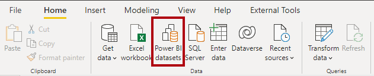
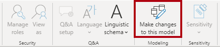
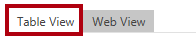
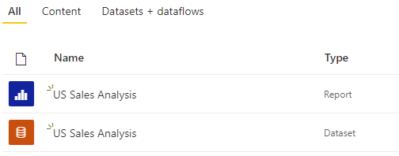

---
lab:
  title: Criar ativos reutilizáveis do Power BI
  module: Manage the analytics development lifecycle
---

# Criar ativos reutilizáveis do Power BI

## Visão geral

**O tempo estimado para concluir o laboratório é de 45 minutos**

Neste laboratório, você criará um conjunto de dados especializado do Power BI que estende um conjunto de dados principal. O conjunto de dados especializado permitirá a análise das vendas per capita nos EUA.

Neste laboratório, você aprenderá a:

- Crie uma conexão dinâmica.

- Crie um modelo DirectQuery local.

- Usar o modo de exibição de linhagem para descobrir ativos dependentes do Power BI.

## Introdução

Neste exercício, você preparará seu ambiente.

### Clonar o repositório para este curso

1. No menu Iniciar, abra o Prompt de Comando

    

1. Na janela do prompt de comando, navegue até a unidade D digitando:

    `d:` 

   Pressione ENTER.

    


1. Na janela do prompt de comando, digite o seguinte comando para baixar os arquivos do curso e salve-os em uma pasta chamada DP500.
    
    `git clone https://github.com/MicrosoftLearning/DP-500-Azure-Data-Analyst DP500`
   
1. Quando o repositório tiver sido clonado, feche a janela do prompt de comando. 
   
1. Abra a unidade D no explorador de arquivos para garantir que os arquivos tenham sido baixados.

### Configurar Power BI

Nesta tarefa, você configurará o Power BI Desktop.

1. Para abrir o Power BI Desktop, na barra de tarefas, selecione o atalho do **Power BI Desktop**.

2. Feche a janela de introdução.

3. No canto superior direito do Power BI Desktop, se ainda não tiver iniciado sessão, selecione **Entrar**. Use as credenciais do laboratório para concluir o processo de entrada.

    
4. Você será redirecionado para a página de inscrição do Power BI no Microsoft Edge. Selecione **Continuar** para concluir a inscrição.

    

5. Insira um número de telefone de 10 dígitos e selecione **Começar**. Selecione **Começar** mais uma vez. Você será redirecionado para o Power BI.

6. No canto superior direito, selecione o ícone de perfil e, em seguida, selecione **Iniciar avaliação**.

    

7. Quando solicitado, selecione **Iniciar avaliação**.


8. Execute as tarefas restantes para concluir a configuração de avaliação.

    *Dica: a experiência do navegador da Web do Power BI é conhecida como o **Serviço do Power BI**.*

### Criar um workspace no Serviço do Power BI

Nesta tarefa, você criará um workspace.

1. No serviço do Power BI, para criar um workspace, no painel **Navegação** (localizado à esquerda), selecione **Workspaces** e, em seguida, selecione **Criar workspaces**.

    


2. No painel **Criar um workspace** (localizado à direita), na caixa **Nome do workspace**, digite um nome para o workspace.

    *O nome do workspace precisa ser exclusivo dentro do locatário.*

    

3. Selecione **Salvar**.

    

    *Uma vez criado, o workspace será aberto. Na próxima tarefa, você publicará um conjunto de dados nesse workspace.*

### Abra o arquivo inicial no Power BI Desktop.

1. Para abrir o Explorador de Arquivos, na barra de tarefas, selecione o atalho do **Explorador de Arquivos**.

2. Procure a pasta **D:\DP500\Allfiles\16\Starter**.

3. Para abrir um arquivo pré-desenvolvido do Power BI Desktop, clique duas vezes no arquivo **Sales Analysis - Create reusable Power BI artifacts.pbix**.

4. Se ainda não tiver iniciado sessão, no canto superior direito do Power BI Desktop, selecione **Iniciar sessão**. Use as credenciais do laboratório para concluir o processo de entrada.

    

### Examinar o modelo de dados

Nesta tarefa, você revisará o modelo de dados.

1. No Power BI Desktop, alterne para a exibição de **Modelo** à esquerda.

    

2. Use o diagrama de modelo para examinar o design do modelo.

    

    *O modelo é composto por seis tabelas dimensionais e uma tabela de fatos. A tabela fatos de **Vendas** armazena os detalhes da ordem de venda do cliente. É um design clássico de esquema de estrelas.*

### Publicar o modelo de dados

Nesta tarefa, você publicará o modelo de dados.

1. Para publicar o relatório, na guia **Página Inicial** da faixa de opções, selecione **Publicar**. 

    *Se solicitado a salvar as alterações, selecione **Salvar***.

    

2. Na janela **Publicar no Power BI**, selecione seu workspace (não o workspace pessoal) e clique em **Selecionar**.

3. Quando a publicação for bem-sucedida, selecione **Entendi**.

    *Depois de publicado, o modelo se torna um conjunto de dados do Power BI. Neste laboratório, esse conjunto de dados é um conjunto de dados principal que um analista de negócios pode estender para criar um conjunto de dados especializado. No próximo exercício, você criará um conjunto de dados especializado para resolver uma necessidade de negócios específica.*

4. Feche o Power BI Desktop.

5. Se solicitado, selecione **Não salvar**.

## Criar um conjunto de dados especializado

Neste exercício, você criará um conjunto de dados especializado para permitir a análise das vendas per capita nos EUA. Como o conjunto de dados principal não contém valores de população, você adicionará uma nova tabela para estender o modelo.

### Criar uma conexão dinâmica

Nesta tarefa, você criará um novo relatório que usa uma conexão dinâmica com o conjunto de dados **Análise de Vendas - Criar artefatos reutilizáveis do Power BI**, que você publicou no exercício anterior.

1. Para abrir o Power BI Desktop, na barra de tarefas, selecione o atalho do **Power BI Desktop**.

2. Feche a janela de introdução.

3. Para salvar o arquivo, na faixa de opções **Arquivo**, selecione **Salvar**.

4. Na janela **Salvar como**, procure a pasta **D:\DP500\Allfiles\16\MySolution**.

5. Na caixa **Nome do arquivo**, insira **Análise de Vendas nos EUA**.

    

6. Selecione **Salvar**.

7. Para criar uma conexão dinâmica, na guia **Página Inicial** da faixa de opções, dentro do grupo **Dados**, selecione **Conjuntos de dados do Power BI**.

    

8. Na janela **Hub de dados**, selecione o conjunto de dados **Análise de Vendas - Criar artefatos reutilizáveis do Power BI**.

    

9. Selecione **Conectar**.

10. Na caixa de diálogo **Conectar seus dados**, marque a caixa ao lado de **Análise de Vendas - Criar artefatos reutilizáveis do Power BI** e selecione **Enviar** para se conectar à fonte de dados.

11. Quando avisado sobre um possível risco de segurança, leia a notificação e selecione **OK**.

12. No canto inferior esquerdo, na barra de status, observe o relatório se conectar ao conjunto de dados.

    

13. Alterne para a exibição de **Modelo**.

    

14. Se necessário, para ajustar o diagrama de modelo à tela, no canto inferior direito, selecione **Ajustar à tela**.

    

15. Passe o cursor sobre qualquer cabeçalho de tabela para revelar uma dica de ferramenta e observe que o tipo de fonte de dados é SQL Server Analysis Services, o servidor se refere ao seu workspace e o banco de dados é o conjunto de dados.

    

    *Essas propriedades indicam que um modelo remoto hospeda a tabela. Na próxima tarefa, você fará alterações no modelo para estendê-lo. Esse processo criará um modelo DirectQuery local que você poderá modificar de diferentes maneiras.*

16. Salve o arquivo do Power BI Desktop.

    

### Criar um modelo DirectQuery local

Nesta tarefa, você criará um modelo DirectQuery local.

1. Na guia **Página Inicial** da faixa de opções, dentro do grupo **Modelagem**, selecione **Fazer alterações neste modelo**.

    

    *Observação: se você não vir a opção para fazer alterações nesse modelo, será necessário habilitar a versão prévia do recurso, o DirectQuery para conjuntos de dados PBI e o AS*.
    - Acesse **Arquivo** > **Opções e configurações** > **Opções** e, na seção Versão prévia dos recursos, marque a caixa de seleção DirectQuery para conjuntos de dados do Power BI e Analysis Services para habilitar essa versão prévia do recurso. Talvez seja preciso reiniciar o Power BI Desktop para que a alteração entre em vigor. 

2. Quando solicitado, leia a mensagem na janela de diálogo e selecione **Adicionar um modelo local**.

    

    *O modelo agora é um modelo DirectQuery. É possível aprimorá-lo modificando determinadas propriedades de tabela ou coluna ou adicionando colunas calculadas. É possível até mesmo estender o modelo com novas tabelas de dados, originadas de outras fontes de dados. Você adicionará uma tabela para incluir dados populacionais dos EUA ao modelo.*

3. Na caixa de diálogo **Conectar seus dados**, verifique se você tem uma marca na caixa ao lado de **Análise de Vendas - Criar artefatos reutilizáveis do Power BI** e selecione **Enviar** para alterar o modo de armazenamento da fonte de dados.

4. Passe o cursor sobre qualquer cabeçalho de tabela para revelar uma dica de ferramenta e observe que o modo de armazenamento da tabela está definido como **DirectQuery**.

    

### Elaborar o layout do relatório

Nesta tarefa, você criará o layout do relatório para analisar as vendas por estado dos EUA.

1. Alterne para a exibição de **Relatório**.

    

2. No painel **Dados** (localizado à direita), expanda para abrir a tabela **Revendedor**.

3. Clique com o botão direito do mouse no campo **País-Região** e selecione **Adicionar aos filtros** > **Filtros no nível do relatório**.

    

4. Expanda para abrir o painel **Filtros** (localizado à esquerda do painel **Visualizações**).

5. No painel **Filtros**, na seção **Filtros em todas as páginas**, no cartão **País-Região**, selecione **Estados Unidos**.

    

6. Para adicionar um visual de tabela, no painel **Visualizações**, selecione o ícone do visual de tabela.

    

7. Reposicione e redimensione a tabela para que ela preencha a página inteira.

8. No painel **Dados**, dentro da tabela **Revendedor**, arraste o campo **Estado-Província** e solte-o no visual da tabela.

    

9. No painel **Dados**, expanda a tabela **Vendas** e adicione o campo **Valor das Vendas** ao visual da tabela.

    

10. Para classificar os estados por ordem decrescente do valor das vendas, selecione o cabeçalho **Soma do Valor das Vendas**.


    *Este layout de relatório agora fornece detalhes básicos sobre as vendas por estado dos EUA. No entanto, um requisito adicional é mostrar as vendas per capita e classificar os estados por ordem decrescente nessa medida.*

### Adicionar uma tabela

Nesta tarefa, você adicionará uma tabela de dados populacionais dos EUA provenientes de uma página da Web.

1. Alterne para a exibição de **Modelo**.

    

2. Na guia **Página Inicial** da faixa de opções, dentro do grupo **Dados**, selecione **Obter dados** e selecione **Web**.

    

3. Na caixa **URL**, digite o seguinte caminho de arquivo: **D:\DP500\Allfiles\16\Assets\us-resident-population-estimates-2020.html**

    *Para os fins deste laboratório, o Power BI Desktop acessará a página da Web a partir do sistema de arquivos.*

    *Dica: é possível copiar e colar o caminho do arquivo **D:\DP500\Allfiles\16\Assets\Snippets.txt**.*

4. Selecione **OK**.

    

5. Na janela **Navegador**, à direita, alterne para a **Exibição da Web**.

    

    *A página apresenta estimativas da população residente nos EUA provenientes do censo de abril de 2020.*

6. Alterne novamente para a exibição de Tabela.

    

7. À esquerda, selecione **Tabela 2**.

    

8. Observe a versão prévia da exibição de tabela.

    *Esta tabela de dados contém os dados exigidos pelo seu modelo para calcular as vendas per capita. Você precisará preparar os dados aplicando transformações: mais especificamente, você removerá a linha **Estados Unidos**, removerá a coluna **CLASSIFICAÇÃO** e renomeará as colunas **ESTADO** e **NÚMERO**.*

9. Para preparar os dados, selecione **Transformar dados**.

    

10. Na janela do Editor do Power Query, no painel **Configurações de Consulta** (localizado à direita), na caixa **Nome**, substitua o texto por **População dos EUA** e pressione **Enter**.

    

11. Para remover a linha **Estados Unidos**, no cabeçalho da coluna **ESTADO**, selecione a seta para baixo e desmarque o item **Estados Unidos** (role até a parte inferior da lista).

    

12. Selecione **OK**.

    

13. Para remover a coluna **CLASSIFICAÇÃO**, clique com botão direito do mouse no cabeçalho da coluna e selecione **Remover**.

    

14. Para renomear a coluna **ESTADO**, clique duas vezes no cabeçalho da coluna, substitua o texto por **Estado** e pressione **Enter**.

15. Renomeie a coluna **NÚMERO** como **População**.

    

16. Para aplicar a consulta, na guia **Página Inicial** da faixa de opções, dentro do grupo **Fechar**, selecione o ícone **Fechar e Aplicar**.

    

17. Quando avisado sobre um possível risco de segurança, leia a notificação e selecione **OK**.

    

    *O Power BI Desktop aplica a consulta para criar uma tabela de modelo. Ele adiciona uma nova tabela que importa dados populacionais no modelo.*

18. Reposicione a tabela **População dos EUA** ao lado da tabela **Revendedor**.

19. Para criar um relacionamento de modelo, na tabela **População dos EUA**, arraste a coluna **Estado** e solte-a na coluna **Estado-Província** da tabela **Revendedor**.

    

20. Na janela **Criar relacionamento**, na lista suspensa **Direção do filtro cruzado**, selecione **Ambas**.

    

    *Cada linha da tabela **Revendedor** armazena um revendedor; portanto, os valores encontrados na coluna **Estado-Província** conterão valores duplicados (por exemplo, há muitos revendedores no estado da Califórnia). Quando você cria o relacionamento, o Power BI Desktop determina automaticamente as cardinalidades de coluna e descobre que se trata de um relacionamento muitos-para-um. Para garantir a propagação dos filtros da tabela **Revendedor** para a tabela **População dos EUA**, o relacionamento deve cruzar o filtro em ambas as direções.*

21. Selecione **OK**.

    

22. Para ocultar a nova tabela, no cabeçalho da tabela **População dos EUA**, selecione o ícone de visibilidade.

    

    *A tabela não precisa estar visível para identificar os autores.*

### Adicionar uma medida

Nesta tarefa, você adicionará uma medida para calcular as vendas per capita.

1. Alterne para a exibição de **Relatório**.

    

2. No painel **Dados**, clique com o botão direito do mouse na tabela **Vendas** e selecione **Nova medida**.

    

3. Na barra de fórmula, insira a definição de medida a seguir.

    *Dica: é possível copiar e colar a definição da medida do arquivo **D:\DP500\Allfiles\16\Assets\Snippets.txt**.*

    ```
    Sales per Capita =
    DIVIDE(
    SUM(Sales[Sales Amount]),
    SUM('US Population'[Population])
    )
    ```

    *A medida denominada **Vendas per Capita** usa a função DAX [DIVIDE](https://docs.microsoft.com/dax/divide-function-dax) para dividir a soma da coluna **Valor das Vendas** pela soma da coluna **População**.*

4. Na guia contextual **Ferramentas de Medida** da faixa de opções, dentro do grupo **Formatação**, defina o número de casas decimais como **4**.

    

5. Para adicionar a medida ao visual de matriz, no painel **Dados**, dentro da tabela **Vendas**, arraste o campo **Vendas per Capita** para o visual da tabela.

    *A medida avalia o resultado combinando dados provenientes de um modelo remoto no serviço do Power BI com dados da tabela importada, que é local do seu novo modelo.*

6. Para classificar os estados por valor decrescente das vendas per capita, selecione o cabeçalho da coluna **Vendas per Capita**.

    

### Publicar a solução

Nesta tarefa, você publicará a solução, que compreende um modelo de dados especializados e um relatório.

1. Salve o arquivo do Power BI Desktop.

    

2. Para publicar a solução, na guia **Página Inicial** da faixa de opções, selecione **Publicar**.

    

3. Na janela **Publicar no Power BI**, selecione seu workspace e clique em **Selecionar**.

    

4. Quando a publicação for bem-sucedida, selecione **Entendi**.

    

5. Feche o Power BI Desktop.

6. Se solicitado, selecione **Não salvar**.

    

### Revise o conjunto de dados especializado

Nesta tarefa, você revisará o conjunto de dados especializados no serviço do Power BI.

1. Alterne para o serviço do Power BI (navegador da Web).

2. Na página de aterrissagem do workspace, observe o relatório **Análise de Vendas nos EUA** e o conjunto de dados **Análise de Vendas nos EUA**.

    


3. Passe o cursor sobre o conjunto de dados **Análise de Vendas nos EUA**, clique nas reticências quando forem exibidas e, em seguida, selecione **Exibir linhagem**.

    

    *A opção **Exibir linhagem** dá suporte à descoberta de dependências entre ativos do Power BI. Isso é importante, por exemplo, se você for publicar alterações em um conjunto de dados principal. A exibição de linhagem informará os conjuntos de dados dependentes que podem exigir testes.*

4. Na exibição de linhagem, observe a conexão entre o relatório, o conjunto de dados **Análise de Vendas nos EUA** e o conjunto de dados **Análise de Vendas - Criar artefatos reutilizáveis do Power BI**.

    

    *Quando os conjuntos de dados do Power BI se relacionam com outros conjuntos de dados, isso é conhecido como encadeamento. Neste laboratório, o conjunto de dados **Análise de Vendas nos EUA** é encadeado ao conjunto de dados **Análise de Vendas - Criar artefatos reutilizáveis do Power BI**, permitindo sua reutilização para fins especializados.*
